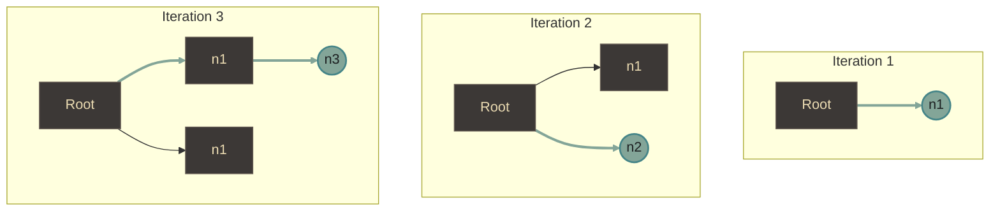
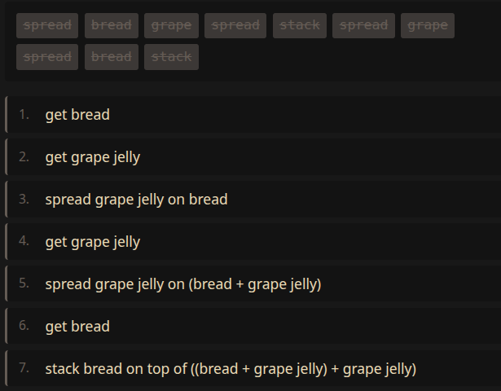

Let's gooooooo!

::: timeline
- From the 60s-80s, we saw fundamental contributions to the study of context-free grammar:
  - In 1961, the CYK parsing algorithm was published [@cyk]
  - In 1968, the Earley parser was published [@earley]
  - In 1974, the GLR parser was formulated [@lang-glr], and then in 1984 it was implemented [@tomita-glr]
- (... skipping a bunch of other things ...)
- In 2023, llama.cpp popularized grammar-constrained decoding for local LLMs [@llama-grammar].
- In 2023, JSON mode finally returns valid JSON [@openai-devday-2023]
- In 2025, state-machine grammars become mainstream [@mastra-state-machine]. Context-Free Grammars (CFG) too: I built a CFG parser to constrain agentic function calls at my current employer.
- In 2025, OpenAI introduced native support for constraining LLM outputs with context-free grammar production rules [@openai-cfg].
- In 2026, world models have been generating some buzz [@maloo2026worldmodels]
:::

Structure is fashionable again. It feels like we're one good abstraction away from grammars having their moment, and I think that abstraction is finally obvious.

The purpose of this post is to outline a framework to talk about grammar generation, inference, and scoring all at once in a clean interface, with the hope that this explanation will simplify future research efforts on this topic.


## A clean interface

Think of a grammar as a strongly-typed object.

For example, this is `G`:

:::graph
root: setup tests teardown
tests: test tests | test
:::

### Top-down generation

You can sample from the grammar (assuming uniform distribution over production choices):

```javascript
p = G.sample()  // returns a Parse
```

You may get a parse that looks a bit like this:

:::parse
root: setup tests teardown
tests: test test test
:::

Then, you can render data from the parse:

```javascript
x = G.render(p)  // returns an Observation
```

Rendering drops the latent structure.

:::render
setup test test test teardown
:::


Sampling is stochastic. So, you may instead get a parse that looks like this:

:::parse
root: setup tests teardown
tests: test test test test test test test test test
:::

Producing parses and rendering observations from those parses is the easy part.


### Bottom-up inference

The harder problem is parsing raw observations.

To demonstrate this, let's change the grammar to be more interesting, one that introduces the concept of running tests in parallel.

:::graph
root: setup tests teardown
tests: test | seq | par
seq: tests then tests
par: tests and tests
:::

Try parsing this observation:

:::render
setup test then test and test teardown
:::


We can call `infer` to discover which parses can explain this data:

```javascript
P = G.infer(obs => obs == x)  // returns Dist<Parse> | null
```

There are two potential parses for the same sequence.

Candidate 1:

:::parse
root: setup seq teardown
seq: test then par
par: test and test
:::

Candidate 2:

:::parse
root: setup par teardown
par: seq and test
seq: test then test
:::


That's why `infer(...)` returns a probability distribution.

You can imagine the probability distribution looks somewhat like this:

:::distribution
1: 0.5
2: 0.5
3: 0
4: 0
5: 0
6: 0
7: 0
8: 0
9: 0
10: 0
:::

Abstracted away is the fact that `infer` is performing a complicated parsing algorithm.
It's giving you access to the posterior:

$$
P(p | x) \propto P(x | p) P(p)
$$


And lastly, we can compute a score using `score`:

```javascript
s = G.score(p, x)  // log P(x | p) + log P(p)
```

This interface is sufficient for some really powerful algorithms, as we'll see below.


## Searching in observation space

`G.infer(...)` can parse partial data, like a prefix of a sequence, or the list of moves made so far in a game.
In other words, it describes the next _possible moves_.

Monte Carlo Tree Search (MCTS), on the other hand, is an algorithm that finds you the approx. _best move_.

Don't get stuck on the name, though.
Maybe a better name would have been "Statistical Tree Search."
The "Monte Carlo" part is a nod to the city of Monte Carlo in Monaco, which is famous for its casinos.
In the literature, "Monte Carlo" is a loaded term that also implies sampling, repeated simulations, balancing exploration vs. exploitation, and a few other relevant ideas, so unfortunately the name's here to stay.

$$
\underbrace{
  \text{Monte Carlo}
  \qquad
  \underbrace{
    \text{Tree}
    \qquad
    \underbrace{\text{Search}}_{\substack{\\[1.0ex]\text{algorithm}}}
  }_{\substack{\\[1.3ex]\text{uses a tree data structure}}}
}_{\substack{\\[1.6ex]\text{named after Monte Carlo sampling}}}
$$

In the algorithm, you construct a tree from scratch, where each path from the root represents the sequence of actions you may take.

Example




The algorithm iterates many times. In each iteration, we build up the tree:

1. Pick a promising starting path
2. Roll out fully to see where it could end
3. Tally up the results

So, to get started, we'll initialize a bare-bones tree.

```javascript
// start with just the root node
tree = Tree([
  Node({
    // initial trivial partial parse
	parse: p0,
	// observation
	obs: "",
	// frequency of usage (will be updated by `backprop`)
	visits: 0,
	// mean utility estimate (will be updated by `backprop`)
	value: 0.0,
  })
])
```

Let's take everything we've learned, using `infer`, `sample`, `render`, and `score` to implement MCTS.
The following code will be repeated in a loop many times:

::: {.code keywords="infer,sample,render,score"}
```javascript
// === 1. pick a promising starting path ===
// tree selects a path (using UCB and prior)
path = tree.select(node => G.score(node.parse, node.obs))
// the last node is our frontier
node = path.at(-1)

// === 2. roll out fully to see where it could end ===
P = G.infer(obs => obs.startsWith(node.obs))
p = P.sample({ reject: node.children.map(c => c.parse) })
x = G.render(p)
nextMove = x.at(node.obs.length)
child = tree.add(node, Node(p, [...node.obs, nextMove]))

// === 3. Tally up the results ===
u = utility(x)
tree.backprop(path, child, u)

```
:::

I know, I threw in a bunch of undefined things in there, such as `tree.select` and `tree.backprop`, but you can imagine an API that lets you vibe-mcts.
For clarity, I must explain:

- `tree.select` builds a path from the root by repeatedly choosing a child using a policy known as UCB/PUCT, with `G.score` acting as a prior.
- `utility(x)` is the value of that state, defined ad-hoc based on the context.
- `tree.backprop` walks back up the path, incrementing `node.visits` and updating the running `node.value` estimate.


But c'mon, isn't that so cool!? You're basically 80% there with just this interface!

## Searching in grammar space

As mentioned earlier, given a grammar model:

- `G.infer(...)` reveals candidate next moves
- The MCTS algorithm above finds the best move

But, how do you learn a grammar in the first place?

Similar to the algorithm above, let's start with a root node. This time, `node.obs` will be grammar objects:

```javascript
// start with just the root node
tree = Tree([
  Node({
    // initial trivial partial parse
	parse: p0,
	// observation, trivial grammar object
	obs: G0,
	// frequency of usage (will be updated by `backprop`)
	visits: 0,
	// mean utility estimate (will be updated by `backprop`)
	value: 0.0,
  })
])
```

Define a set of edit actions one can perform on grammars.

Do you see where I'm going with this?

Run the same MCTS algorithm above, but instead of searching through the space of observations constrained by grammar actions, search through the space of grammar objects constrained by grammar-edit actions.

For example, let's say you'd like to learn how to make a peanut butter and jelly (PB&J) sandwich. Let's establish some atomic concepts:

- nouns:
  - `bread`
  - Jelly (`strawberry`, `grape`)
  - Peanut butter (`crunchy`, `smooth`)
- verbs:
  - `spread` (for spreading things on bread)
  - `stack` (for stacking slices of bread)

The following grammar generates instructions on making PB&J sandwiches:

::: {.scfg model='{"init":{"kind":"or","alts":["single-method","two-slice"]},"single-method":{"kind":"and","parts":["bread",{"kind":"or","alts":["crunchy","smooth"]},"spread",{"kind":"or","alts":["grape","strawberry"]},"spread","bread","stack"]},"two-slice":{"kind":"and","parts":["pb-slice","jelly-slice","stack"]},"pb-slice":{"kind":"and","parts":["bread",{"kind":"or","alts":["crunchy","smooth"]},"spread"]},"jelly-slice":{"kind":"and","parts":["bread",{"kind":"or","alts":["grape","strawberry"]},"spread"]}}' symbols='["bread","crunchy","smooth","grape","strawberry","spread","stack"]' title="PB&J Grammar" mode="run"}
:::

Sampling from that grammar will produce a sequence of words that maybe at first glance sound like gibberish, but I've been careful to ensure it compiles to valid Forth [@forth] code. Hit the "Sample & Run" button to see for yourself!

Searching in grammar space means starting from a trivial grammar, and performing a sequence of edits to discover an optimal grammar. And, it's harder than it sounds.

Can you edit this grammar below into the one above?

::: {.scfg model='{"init":"bread"}' symbols='["bread","crunchy","smooth","grape","strawberry","spread","stack"]' title="Build a Grammar" mode="edit"}
:::

Click the edit operations above to transform the grammar. I gave up after 20 seconds.

The goal of the MCTS algorithm is to find the sequence of actions that will get us there, by mutating the grammar to maximize a pre-defined utility.

### Grammar synthesis

In the demo below, click "Start Search" to watch MCTS discover a grammar that matches a set of target sequences:

::: {.scfg model='{"init":"bread"}' symbols='["bread","crunchy","smooth","grape","strawberry","spread","stack"]' targets='[["bread","crunchy","spread","grape","spread","bread","stack"],["bread","smooth","spread","grape","spread","bread","stack"],["bread","crunchy","spread","bread","grape","spread","stack"],["bread","smooth","spread","bread","grape","spread","stack"],["bread","crunchy","spread","strawberry","spread","bread","stack"]]' title="Grammar Search" mode="infer"}
:::


The search uses MCTS over grammar-edit actions and scores candidates.

After you run the search, pay special attention to the "novel idea" section.
It'll show you an observation that doesn't exist in the training data.
You can hit run to see the idea play out.





The beauty of grammar synthesis is that the learned model's divergence from the training data is a feature not a bug!


For a deeper dive into this approach, see my dissertation [@shukla2019utility].


## References
