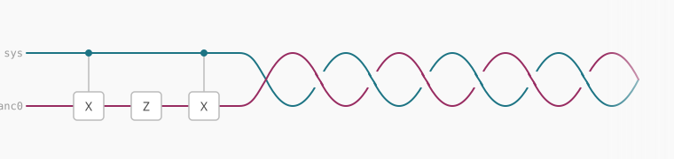

Functional programmers **hate** mutable variables.

Take this Python snippet, for instance. 
Imagine you're reviewing a PR and you spot this:

```python
def poll_usage():
  is_backup_needed = False
  ...
  if is_usage_high:
    # toggle
    is_backup_needed = not is_backup_needed
  ...
```

The variable `is_backup_needed` feels wrong. 
To me, this imperative approach is anxiety inducing.
I would prefer an immutable variable since assignment only needs to happens once.
Then, there's never any doubt about whether the variable is "ready" to use yet.
As you can see, over time, we each develop our own preferences and coding styles.

This same discourse around type-safety, immutable variables, and software engineering best practices are not as mature in the quantum computing world.
We'll talk about it soon, but let's return to that code snippet.

Here's a silly (and interesting, as you'll see soon) way to refactor it:

```python
def maybe_invert(condition, _aux):
  aux = _aux
  if condition:
    aux = not aux
  return aux

def poll_usage():
  ...
  is_backup_needed = maybe_invert(is_usage_high, False)
  ...
```

I know it looks stupid, and in Python there's better ways, but stick with me for the payoff.

In quantum computing, the `maybe_invert(...)` function is commonly called the `CX` gate ("C" for Controlled or Conditional, "X" for not), and it's used _all the time_.

You can run `CX` in superposition, so it acts on multiple computational branches at once and can create entanglement. 
That is one of the basic ingredients used to build algorithms that promise speedups on future fault-tolerant quantum computers.

In practice, that looks like this:

```python
# variable 0 is the condition
# variable 1 is the ancilla (or aux)
# The CX gate is like `maybe_invert`
qc.cx(0, 1)
# variable 1 now holds the "return value", kind of
```

However, a major pain in the ass in quantum computing is that temporary variables (ancillae) need to be reset before you reuse or discard them.

```python
qc.cx(0, 1)  # compute ancilla
qc.z(1)      # do something with the ancilla
???          # IMPORTANT: uncompute ancilla
```

If you forget to do so, you've committed a sin as woeful as indexing an array out of bounds or referencing an invalid pointer. 
Your quantum speedup will crash, your towelettes will no longer be moist, and your felt baseball cap will lose the soft touch it once had.

Quantum is hard because your toolbox of things you can do on variables (qubits) is a _bit_ limited. 
It would be too easy to simply assign `aux = 0`, pack up your bags, and go home.
Nonetheless, Perlis said "a language that doesn't affect the way you think about programming is not worth knowing."

There really isn't much out there to help programmers catch these issues, so I've prototyped a Python DSL called `b01t`, which has `ancilla` blocks that look like this:

```python
with ancilla(1) as anc:
  compute(lambda: cx(sys[0], anc[0]))
  phase(lambda: z(anc[0]))
  uncompute()
```

Heyo, that kinda speaks for itself! 

By the way, the following are guaranteed:

- ✅ Soundness: every quantum program produced by this DSL is safe. No false promises.
- ✅️ Correctness: every safe quantum program could be expressed by this DSL. 


Please try it out! **[https://github.com/binroot/b01t](https://github.com/binroot/b01t)**

Want to collaborate? [nishant@shukla.io](mailto:nishant@shukla.io).
