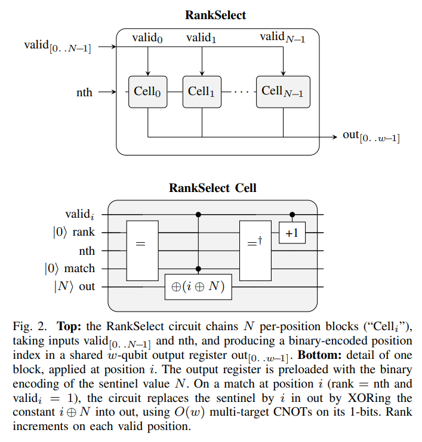

:::narrator
They say the **Ioni** are social creatures living peacefully on planet **Quantos**.
You have been summoned by their health ministry.
:::

:::narrator
It's your first day on the job.
:::

::: {.dialog data-resp="Umm.."}
Hey, yea so, gonna head out early today. There's a **virus** going around town. I'll put you in charge of placing **vaccine centers**.
You got this, right?
:::

::: {.dialog data-resp="Okay|I got this"}
Just keep everyone alive.
Let me show you the controls.
:::

:::narrator
The Ioni are very trusting.
:::

:::narrator
You're asked to place a limited number of vaccine centers to slow the spread.
[Red]{.c-infected} = infected and may die (too late to be vaccinated).
[Gray]{.c-susceptible} = susceptible (vaccinate them).
[Green]{.c-vaccinated} = immune.
[X]{.c-dead} = dead.
**Ready?**
:::


:::fig1
:::

:::narrator
The next day.
:::

::: {.dialog data-resp="I tried my best!|You left me all by myself"}
Morning, sorry I'm late.
**Oh my...**
What did you do?!
:::

:::narrator
You both enter through a door into a room with a machine dominating the space in every feng shui way possible.
:::

::: {.dialog data-resp="Yea|A little"}
We can't be placing these vaccine centers manually anymore.
Listen, can you code?
:::

:::narrator
Your time to shine. **LFG.**
:::

:::fig2
Each cell is represented as a binary mask.
1 = valid (you can place here).
0 = invalid (not allowed).
:::


::: {.dialog data-resp="We're implementing a rollout?|Like a simulator?"}
We need your help writing an algorithm to place these vaccine centers.
Let's start with a basic **valid-move selector** function.
Then we can compose it many times to simulate many moves ahead.
:::

::: {.dialog data-resp="Easy peasy!|You mean, right now?"}
Bingo! Take this keyboard. Write a function called `select`.
Supply it with a boolean array, and have it select the `n`-th true item.
:::

:::narrator
There's no tab-complete, and certainly no coding agent installed here.
Nervous, you wipe a drop of sweat before it's spotted.
:::

:::narrator
You somehow managed to implement the function.
It's in a C-like language.
:::

:::fig-v1
```c
int select(const bool *valid, int n_valid, int n) {
    int count = 0;
    for (int i = 0; i < n_valid; i++) {
        if (valid[i]) {
            if (count == n) return i;
            count++;
        }
    }
    return -1;
}
```
:::

::: {.dialog data-resp="Why not?|WTF?"}
Very good!
But I can't use this.
:::

::: {.dialog data-resp="Like malloc?|You need a new machine..."}
Quantos machines do not clean up after you.
You'd expect `count` to disappear when the function returns. Not here.
You need to **manage** it.
:::


:::narrator
You squint at the code.
The keyboard clicker clackers loudly as you make your edits.
:::


:::fig-v2
```c
int select(const bool *valid, int n_valid, int n) {
    int *count = malloc(sizeof(int));
    *count = 0;
    int result = -1;
    for (int i = 0; i < n_valid; i++) {
        if (valid[i]) {
            if (*count == n) { result = i; break; }
            (*count)++;
        }
    }
    free(count);
    return result;
}
```
:::

::: {.dialog data-resp="I'll add more args|Dependency injection, huh?"}
Smart, but there's no `malloc` allowed; these machines are a bit finicky.
You see, we'll need to supply every function with its own scratch buffer.
Heck, even `result` should be an arg.
:::

:::narrator
"This is stupid," you think to yourself.
But you've seen worse. You've done worse.
:::


:::fig-v3
```c
void select(int *scratch, int *out, const bool *valid, int n_valid, int n) {
    *scratch = 0;
    *out = -1;
    for (int i = 0; i < n_valid; i++) {
        if (valid[i]) {
            if (*scratch == n) { *out = i; break; }
            (*scratch)++;
        }
    }
}
```
:::

::: {.dialog data-resp="..."}
Oh, you know what... something doesn't look right.
:::

::: {.dialog data-resp="Mother f.."}
The args must only be mutated by **invertible** operators, otherwise the machine will jam [@nielsen2010].
Like, the inverse of `^` (XOR) is itself, so that's safe to use. Not a big deal, I hope.
:::

:::narrator
Baffled, you make the final edits.
You pull out the XOR trick [@bennett1973; @toffoli1980].
:::

:::fig-v4
```c
// caller: pre-load *out = n_valid (the not-found sentinel)
void select(int *scratch, int *out,
            const bool *valid, int n_valid, int n) {
    int sentinel = n_valid;

    for (int i = 0; i < n_valid; i++) {
        if (valid[i]) {
            if (*scratch == n) *out ^= (i ^ sentinel);
            (*scratch)++;
        }
    }
}
```
:::


::: {.dialog data-resp="I don't get paid enough for this|What in the world are you smoking?"}
Incredible! But one more thing...
All the `scratch` values need to be reset.
:::


:::narrator
You decrement what you increment.
:::

:::fig-v5
```c
// caller: pre-load *out = n_valid (the not-found sentinel)
void select(int *scratch, int *out,
            const bool *valid, int n_valid, int n) {
    int sentinel = n_valid;

    for (int i = 0; i < n_valid; i++) {
        if (valid[i]) {
            if (*scratch == n) *out ^= (i ^ sentinel);
            (*scratch)++;
        }
    }

    for (int i = 0; i < n_valid; i++) {
        if (valid[i]) (*scratch)--;
    }
}
```
:::

::: {.dialog data-resp="Hold on... is this a quantum computer?|*flees the planet*"}
Boo-yea baby! That's the **rank-select** primitive.
We've been stuck on it for ten years.
Anyway. Ready for the next algorithm?
Let's implement the **state-transition** function.
:::

:::narrator
You eye the exit. Now's your chance.
:::

::: {.dialog data-resp=""}
First we'll need a fresh scratch register, then...
**Huh.**
Must've stepped out for a bit. I'll wait.
:::


:::narrator
You're on your way home, in thruster-to-thruster traffic on the Intergalactic-405.
With the spare time, you scribble what you remember:



Back on Earth, you write up the paper: [arXiv preprint](https://arxiv.org/abs/2604.25962v1) [@shukla2026qce]. Then a blog post.

You're reading it now.
:::


## References
