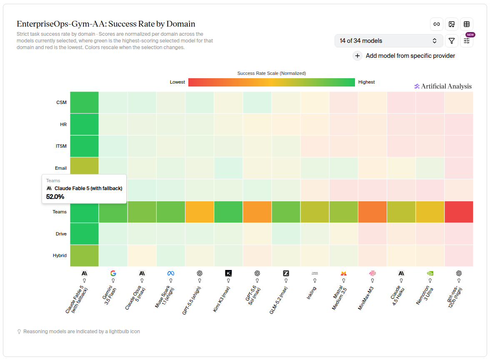

```{=html}
<style>
/* The list number is painted by the li, outside the span. Pulling the span
   left by a marker's width and paying it back as padding extends the band
   over the number without moving any text. Default box-decoration-break
   keeps the extra padding on the first fragment only when the line wraps. */
.the-model{
  padding:.16em .45em .16em 1.75em;
  margin-left:-1.75em;
  background:rgba(207,63,34,.13);
  border-radius:3px;
}
/* Break out of the prose column up to the chart's own 1176px, then shrink
   with the window. 50% is half the containing paragraph, so the negative
   margin re-centres the wider box on the same axis as the text. */
a.wide{
  --w:min(1176px, calc(100vw - 48px));
  display:block; width:var(--w);
  margin:1.5em 0 1.5em calc(50% - var(--w)/2);
}
a.wide img{display:block; width:100%; height:auto}
</style>
```

Agent failures are often [environment failures disguised as model failures](https://rywalker.com/context-engineering-hard-problem).

To detangle the failure modes, we build benchmarks (also called gyms) that control the environment so we can better study and improve the model in isolation.

In this post, I seek a method to score benchmarks themselves.

# Agents train at the Gym

Gyms are typically made up of these 7 components:

1. Task specification: the user prompt and initial context
2. Agent policy: the system prompt, finetuning, or other behavior nudging
3. [Planning & reasoning: the model itself]{.the-model}
4. Tool contract: the list of tools available, their descriptions, and their params
5. Tool implementation: how executing each tool affects the state
6. Environment state: the simulation of the real world
7. Verifier: assertions to judge the outcome of the gym scenario (pass/fail)

That's a lot of points of failure! However, only #3 measures the model itself.

When you investigate a failing gym scenario, these are common symptoms you may witness:

- "Won't follow instructions"
- "Flaky: passes sometimes"
- "Hits a hard ceiling"
- "Just not smart enough"

The problem is, it's not always easy to attribute causes to the symptom.
Click around to see what I'm talking about:

```{=html}
<style>
#convergence-map{
  --n-bg:#fff; --n-line:#d7dae0; --n-text:#16181c; --n-mute:#6b7280;
  --edge:#9aa1ab; --a1:#3b6ef6; --a2:#0d8f82; --alarm:#cf3f22;
  --focus:#16181c;
  --cvg-w:min(960px,calc(100vw - 48px));
  width:var(--cvg-w); margin:2.4rem 0 2.4rem calc(50% - var(--cvg-w)/2);
  box-sizing:border-box; position:relative; padding:0; border:0; background:none;
  font-family:'Ubuntu',system-ui,-apple-system,"Segoe UI",Roboto,Helvetica,Arial,sans-serif;
  color:var(--n-text);
  -webkit-text-size-adjust:100%;
}
#convergence-map *{box-sizing:border-box}
#convergence-map{color-scheme:light}

.cvg-stage{
  display:grid; grid-template-columns:280px minmax(180px,1fr) 280px;
  grid-template-rows:auto auto; row-gap:30px; position:relative;
}
.cvg-col{display:flex; flex-direction:column; gap:9px; min-width:0}
.cvg-causes{grid-column:1; grid-row:1}
.cvg-symptoms{grid-column:3; grid-row:1; justify-content:center}
.cvg-terminal{grid-column:2 / span 2; grid-row:2; justify-self:stretch}
.cvg-bundle,.cvg-drop{display:none}

.cvg-edges{position:absolute; inset:0; width:100%; height:100%; overflow:visible; pointer-events:none; z-index:0}
.cvg-edge,.cvg-tedge,.cvg-pulse{fill:none; stroke-linecap:round}
.cvg-edge{stroke:var(--edge); stroke-width:1; opacity:.5; transition:opacity .18s ease, stroke .18s ease, stroke-width .18s ease}
.cvg-edge.is-hot{opacity:.9; stroke-width:1.6}
.cvg-tedge{stroke:var(--alarm); stroke-width:1.2; opacity:.55}
.cvg-pulse{stroke:var(--edge); stroke-width:2.4; opacity:0}

.cvg-node{
  position:relative; z-index:1; display:block; width:100%; text-align:left;
  font:inherit; cursor:pointer; appearance:none;
  background:var(--n-bg); color:var(--n-text);
  border:1px solid var(--n-line); border-radius:8px; padding:9px 12px;
  transition:transform .14s ease, opacity .18s ease, border-color .18s ease, background .18s ease, box-shadow .18s ease;
}
.cvg-label{display:block; font-size:15px; line-height:1.3; font-weight:500}
.cvg-tag{display:block; font-size:10.5px; line-height:1.35; margin-top:3px; color:var(--n-mute); opacity:.85}
.cvg-node:hover{transform:translateY(-1px); border-color:var(--n-mute); box-shadow:0 2px 8px rgba(0,0,0,.07)}
.cvg-node:focus{outline:none}
.cvg-node:focus-visible{outline:2px dashed var(--focus); outline-offset:3px; opacity:1 !important}

.cvg-terminal{
  background:var(--n-bg); border:1.5px solid var(--alarm); border-radius:8px;
  color:var(--alarm); padding:13px 16px; text-align:center;
  font-size:12.5px; font-weight:700; letter-spacing:.09em; line-height:1.45;
  position:relative; z-index:1;
}

.cvg[data-sel] .cvg-node{opacity:.15}
.cvg[data-sel] .cvg-node.is-sel,.cvg[data-sel] .cvg-node.is-lit{opacity:1}
.cvg[data-sel] .cvg-edge{opacity:.12; stroke-width:1}
.cvg[data-sel="cause"] .cvg-node.is-sel{border-color:var(--a1); background:color-mix(in srgb,var(--a1) 9%,var(--n-bg))}
.cvg[data-sel="cause"] .cvg-node.is-lit{border-color:var(--a2)}
.cvg[data-sel="symptom"] .cvg-node.is-sel{border-color:var(--a2); background:color-mix(in srgb,var(--a2) 10%,var(--n-bg))}
.cvg[data-sel="symptom"] .cvg-node.is-lit{border-color:var(--a1)}
.cvg-edge.is-active{
  opacity:1 !important; stroke-width:2.5; stroke-dasharray:var(--len);
  animation:cvg-draw 400ms ease-out both; filter:drop-shadow(0 0 4px currentColor);
}
.cvg[data-sel="cause"] .cvg-edge.is-active{stroke:var(--a1); color:var(--a1)}
.cvg[data-sel="symptom"] .cvg-edge.is-active{stroke:var(--a2); color:var(--a2)}
@keyframes cvg-draw{from{stroke-dashoffset:var(--len)}to{stroke-dashoffset:0}}
.cvg-pulse.is-pulsing{opacity:.4; stroke-dasharray:14px var(--len); animation:cvg-pulse 1.9s linear}
@keyframes cvg-pulse{from{stroke-dashoffset:14px}to{stroke-dashoffset:calc(-1 * var(--len))}}

.cvg-card{
  position:absolute; z-index:3; width:300px;
  background:var(--n-bg); border:1px solid var(--n-line); border-radius:8px;
  padding:12px 14px; box-shadow:0 6px 22px rgba(0,0,0,.13); font-size:13px;
}
.cvg-card[hidden]{display:none}
.cvg-card-title{font-size:13px; font-weight:700; margin-bottom:9px}
.cvg-card dl{margin:0; display:grid; gap:7px}
.cvg-card dt{
  font-family:ui-monospace,SFMono-Regular,Menlo,Consolas,monospace;
  font-size:10px; letter-spacing:.07em; text-transform:uppercase; color:var(--n-mute);
}
.cvg-card dd{margin:1px 0 0; font-size:12.5px; line-height:1.4}
.cvg-card.is-badge{
  width:auto; white-space:nowrap; font-size:12.5px; font-weight:500;
  padding:8px 12px; border-color:var(--a2);
}
.cvg-card.is-wrap{white-space:normal}
.cvg-card.is-docked{
  position:relative; left:auto !important; right:auto !important; top:auto !important;
  width:100%; white-space:normal; margin-top:14px; box-shadow:none;
}
.cvg-hint{display:none; margin-top:14px; font-size:11.5px; color:var(--n-mute); letter-spacing:.04em}
.cvg.is-ready .cvg-hint{display:block}
.cvg.is-touched .cvg-hint{display:none}

@media (max-width:899px){
  .cvg-stage{grid-template-columns:1fr minmax(140px,.7fr) 1fr}
  .cvg-label{font-size:13.5px}
  .cvg-node{padding:7px 10px}
  .cvg-card{width:250px; font-size:12px}
}
@media (max-width:599px){
  .cvg-stage{display:block; row-gap:0}
  .cvg-edges{display:none}
  .cvg-col{gap:7px}
  .cvg-bundle{display:block; width:100%; height:58px; margin:4px 0; overflow:visible}
  .cvg-bundle path{fill:none; stroke:var(--edge); stroke-width:1.2; opacity:.5; transition:opacity .2s ease, stroke .2s ease}
  .cvg[data-sel] .cvg-bundle path{opacity:.1}
  .cvg-bundle path.is-active{opacity:1; stroke-width:2.4}
  .cvg-bundle .cvg-in.is-active{stroke:var(--a1)}
  .cvg-bundle .cvg-out.is-active{stroke:var(--a2)}
  .cvg-drop{display:block; width:2px; height:22px; margin:6px auto; background:var(--alarm); opacity:.6}
  .cvg-terminal{font-size:11px; letter-spacing:.06em}
}
@media (prefers-reduced-motion:reduce){
  #convergence-map *{animation:none !important; transition:none !important}
  .cvg-pulse{display:none}
}
</style>

<div id="convergence-map" class="cvg">
  <div class="cvg-stage">
    <svg class="cvg-edges" role="img" focusable="false"
         aria-label="Seven possible causes converge onto four observed symptoms, and all four symptoms are attributed to the model."></svg>

    <div class="cvg-col cvg-causes">
      <button type="button" class="cvg-node" data-id="spec" aria-pressed="false"><span class="cvg-label">Task specification</span><span class="cvg-tag">ambiguous prose</span></button>
      <button type="button" class="cvg-node" data-id="policy" aria-pressed="false"><span class="cvg-label">Agent policy</span><span class="cvg-tag">overconstrained rules</span></button>
      <button type="button" class="cvg-node" data-id="planning" aria-pressed="false"><span class="cvg-label">Planning &amp; reasoning</span><span class="cvg-tag">actual model error</span></button>
      <button type="button" class="cvg-node" data-id="contract" aria-pressed="false"><span class="cvg-label">Tool contract</span><span class="cvg-tag">docs &ne; behavior</span></button>
      <button type="button" class="cvg-node" data-id="impl" aria-pressed="false"><span class="cvg-label">Tool implementation</span><span class="cvg-tag">partial side effects</span></button>
      <button type="button" class="cvg-node" data-id="state" aria-pressed="false"><span class="cvg-label">Environment state</span><span class="cvg-tag">undefined / drifting</span></button>
      <button type="button" class="cvg-node" data-id="verifier" aria-pressed="false"><span class="cvg-label">Verifier</span><span class="cvg-tag">unsatisfiable checks</span></button>
    </div>

    <svg class="cvg-bundle" viewBox="0 0 200 58" preserveAspectRatio="none" aria-hidden="true">
      <path class="cvg-in" data-id="spec"     d="M10 1 Q10 26 100 26"/>
      <path class="cvg-in" data-id="policy"   d="M40 1 Q40 26 100 26"/>
      <path class="cvg-in" data-id="planning" d="M70 1 Q70 26 100 26"/>
      <path class="cvg-in" data-id="contract" d="M100 1 L100 26"/>
      <path class="cvg-in" data-id="impl"     d="M130 1 Q130 26 100 26"/>
      <path class="cvg-in" data-id="state"    d="M160 1 Q160 26 100 26"/>
      <path class="cvg-in" data-id="verifier" d="M190 1 Q190 26 100 26"/>
      <path class="cvg-out" data-id="disobey" d="M100 32 C100 48 25 42 25 57"/>
      <path class="cvg-out" data-id="flaky"   d="M100 32 C100 48 75 42 75 57"/>
      <path class="cvg-out" data-id="ceiling" d="M100 32 C100 48 125 42 125 57"/>
      <path class="cvg-out" data-id="dumb"    d="M100 32 C100 48 175 42 175 57"/>
    </svg>

    <div class="cvg-col cvg-symptoms">
      <button type="button" class="cvg-node" data-id="disobey" aria-pressed="false"><span class="cvg-label">&ldquo;Won&rsquo;t follow instructions&rdquo;</span></button>
      <button type="button" class="cvg-node" data-id="flaky" aria-pressed="false"><span class="cvg-label">&ldquo;Flaky: passes sometimes&rdquo;</span></button>
      <button type="button" class="cvg-node" data-id="ceiling" aria-pressed="false"><span class="cvg-label">&ldquo;Hits a hard ceiling&rdquo;</span></button>
      <button type="button" class="cvg-node" data-id="dumb" aria-pressed="false"><span class="cvg-label">&ldquo;Just not smart enough&rdquo;</span></button>
    </div>

    <div class="cvg-drop" aria-hidden="true"></div>
    <div class="cvg-terminal">ALL OF THE ABOVE GET BLAMED ON THE MODEL</div>
  </div>

  <p class="cvg-hint">click a node</p>
  <div class="cvg-card" role="status" aria-live="polite" hidden></div>
</div>

<script>
(function(){
  var root = document.getElementById('convergence-map');
  if(!root || !root.querySelector) return;

  var DETAIL = {
    spec:     ['Two valid readings of one sentence','Same trajectory, different answer, ~50% pass','4 identical runs → 2 pass, 2 fail'],
    policy:   ['Rules forbid the only working strategy','Agent aborts early, does almost nothing','“Exactly one lookup, never infer” → 18 runs ended in ≤3 calls'],
    planning: ['Model picks the wrong step','Wrong step','The only cause that is actually the model'],
    contract: ['Documentation contradicts the server','Careful agents refuse; reckless agents pass','Docs contradict the server'],
    impl:     ['Write commits, response errors','Retry storms, duplicate records','Row count 22 → 23 across a “failed” call'],
    state:    ['“Now” is never defined','Agent refuses to schedule anything','Relative dates with no reference clock'],
    verifier: ['Check can never pass','Ceiling no model crosses','Integer 1 compared to string “1”']
  };
  var LINKS = {
    spec:['flaky','dumb'], policy:['disobey','ceiling'], planning:['dumb','flaky'],
    contract:['disobey','dumb'], impl:['flaky','ceiling'], state:['flaky','ceiling'],
    verifier:['ceiling','dumb']
  };
  var CAUSE_IDS = Object.keys(LINKS);
  var REVERSE = {};
  CAUSE_IDS.forEach(function(c){
    LINKS[c].forEach(function(s){ (REVERSE[s] = REVERSE[s] || []).push(c); });
  });

  var NS = 'http://www.w3.org/2000/svg';
  var stage = root.querySelector('.cvg-stage');
  var svg = root.querySelector('.cvg-edges');
  var card = root.querySelector('.cvg-card');
  var terminal = root.querySelector('.cvg-terminal');
  var bundle = root.querySelectorAll('.cvg-bundle path');
  var causeCol = root.querySelector('.cvg-causes');
  var symCol = root.querySelector('.cvg-symptoms');
  var nodes = {}, node;
  var nodeList = root.querySelectorAll('.cvg-node');
  for(var i=0;i<nodeList.length;i++){ nodes[nodeList[i].dataset.id] = nodeList[i]; }

  var edges = [], tedges = [], sel = null, selKind = null;
  var reduced = window.matchMedia && window.matchMedia('(prefers-reduced-motion: reduce)').matches;

  function mk(cls){ var p = document.createElementNS(NS,'path'); p.setAttribute('class',cls); return p; }

  function build(){
    var pulseLayer = document.createElementNS(NS,'g');
    CAUSE_IDS.forEach(function(from){
      LINKS[from].forEach(function(to){
        var e = {from:from, to:to, path:mk('cvg-edge'), pulse:mk('cvg-pulse')};
        svg.appendChild(e.path); pulseLayer.appendChild(e.pulse); edges.push(e);
      });
    });
    ['disobey','flaky','ceiling','dumb'].forEach(function(to){
      var t = {to:to, path:mk('cvg-tedge'), pulse:mk('cvg-pulse')};
      svg.insertBefore(t.path, svg.firstChild); pulseLayer.appendChild(t.pulse); tedges.push(t);
    });
    svg.appendChild(pulseLayer);
  }

  function box(el, base){
    var r = el.getBoundingClientRect();
    return {l:r.left-base.left, r:r.right-base.left, t:r.top-base.top, b:r.bottom-base.top,
            cx:(r.left+r.right)/2-base.left, cy:(r.top+r.bottom)/2-base.top};
  }

  function layout(){
    if(!stage.offsetWidth) return;
    var base = stage.getBoundingClientRect();
    svg.setAttribute('viewBox', '0 0 ' + base.width + ' ' + base.height);
    var p = {};
    for(var id in nodes){ p[id] = box(nodes[id], base); }
    var term = box(terminal, base);

    function set(o, d){
      o.path.setAttribute('d', d); o.pulse.setAttribute('d', d);
      var len = o.path.getTotalLength();
      o.path.style.setProperty('--len', len + 'px');
      o.pulse.style.setProperty('--len', len + 'px');
    }
    edges.forEach(function(e){
      var a = p[e.from], b = p[e.to];
      var dx = Math.max(40, (b.l - a.r) * 0.48);
      set(e, 'M' + a.r + ' ' + a.cy + ' C' + (a.r+dx) + ' ' + a.cy + ' ' + (b.l-dx) + ' ' + b.cy + ' ' + b.l + ' ' + b.cy);
    });
    // Symptom-to-terminal edges leave through the left edge of the symptom column
    // rather than dropping straight down, so they never run behind the nodes
    // stacked underneath (which show through once those nodes dim).
    tedges.forEach(function(t){
      var a = p[t.to], x0 = a.l, y0 = a.b - 8;
      var c1 = x0 - Math.max(60, (x0 - term.cx) * 0.9);
      var c2 = term.t - Math.max(26, (term.t - y0) * 0.45);
      set(t, 'M' + x0 + ' ' + y0 + ' C' + c1 + ' ' + y0 + ' ' + term.cx + ' ' + c2 + ' ' + term.cx + ' ' + term.t);
    });
    if(sel) place();
  }

  function clearAll(){
    for(var id in nodes){
      nodes[id].classList.remove('is-sel','is-lit');
      nodes[id].setAttribute('aria-pressed','false');
    }
    edges.forEach(function(e){ e.path.classList.remove('is-active','is-hot'); });
    for(var i=0;i<bundle.length;i++){ bundle[i].classList.remove('is-active'); }
    card.hidden = true;
    delete root.dataset.sel;
    sel = null; selKind = null;
  }

  function bundleOn(cls, id){
    for(var i=0;i<bundle.length;i++){
      if(bundle[i].classList.contains(cls) && bundle[i].dataset.id === id) bundle[i].classList.add('is-active');
    }
  }

  // The card is absolutely positioned against #convergence-map's padding box, so
  // offsets are measured from there, not from the stage. Available room is measured
  // against the opposite column so the card never lands on top of a lit node.
  function place(){
    card.style.cssText = '';
    card.classList.remove('is-docked','is-wrap');
    var host = root.getBoundingClientRect();
    var padL = host.left + root.clientLeft, padT = host.top + root.clientTop;
    var padR = padL + root.clientWidth;
    var sBox = stage.getBoundingClientRect();
    var nb = nodes[sel].getBoundingClientRect();
    var gap = 16, x, avail;

    if(selKind === 'cause'){
      x = nb.right + gap;
      avail = symCol.getBoundingClientRect().left - gap - x;
    } else {
      x = nb.left - gap;
      avail = x - causeCol.getBoundingClientRect().right - gap;
    }
    if(sBox.width < 620 || avail < 190){ card.classList.add('is-docked'); return; }

    if(selKind === 'cause'){
      card.style.left = (x - padL) + 'px';
      card.style.width = Math.min(300, avail) + 'px';
    } else {
      card.style.right = (padR - x) + 'px';
      if(card.offsetWidth > avail){ card.classList.add('is-wrap'); card.style.width = avail + 'px'; }
    }
    var top = nb.top + nb.height/2 - card.offsetHeight/2;
    top = Math.max(sBox.top, Math.min(top, sBox.bottom - card.offsetHeight));
    card.style.top = (top - padT) + 'px';
  }

  function select(id, kind){
    clearAll();
    root.classList.add('is-touched');
    sel = id; selKind = kind;
    root.dataset.sel = kind;
    nodes[id].classList.add('is-sel');
    nodes[id].setAttribute('aria-pressed','true');

    var others = kind === 'cause' ? LINKS[id] : REVERSE[id];
    others.forEach(function(o){ nodes[o].classList.add('is-lit'); });
    bundleOn(kind === 'cause' ? 'cvg-in' : 'cvg-out', id);
    others.forEach(function(o){ bundleOn(kind === 'cause' ? 'cvg-out' : 'cvg-in', o); });

    var hot = edges.filter(function(e){ return kind === 'cause' ? e.from === id : e.to === id; });
    svg.getBoundingClientRect();
    hot.forEach(function(e){ e.path.classList.add('is-active'); });

    if(kind === 'cause'){
      var d = DETAIL[id];
      card.className = 'cvg-card';
      card.innerHTML = '<div class="cvg-card-title"></div><dl>' +
        '<div><dt>fails</dt><dd class="f"></dd></div>' +
        '<div><dt>symptom</dt><dd class="l"></dd></div>' +
        '<div><dt>example</dt><dd class="e"></dd></div></dl>';
      card.querySelector('.cvg-card-title').textContent = nodes[id].querySelector('.cvg-label').textContent;
      card.querySelector('.f').textContent = d[0];
      card.querySelector('.l').textContent = d[1];
      card.querySelector('.e').textContent = d[2];
    } else {
      card.className = 'cvg-card is-badge';
      card.textContent = nodes[id].querySelector('.cvg-label').textContent +
        ' ← ' + others.length + ' possible cause' + (others.length === 1 ? '' : 's');
    }
    card.hidden = false;
    place();
  }

  function hover(id, on){
    if(sel) return;
    edges.forEach(function(e){
      if(e.from === id || e.to === id) e.path.classList.toggle('is-hot', on);
    });
  }

  build();

  for(var j=0;j<nodeList.length;j++){
    (function(n){
      var id = n.dataset.id, kind = LINKS[id] ? 'cause' : 'symptom';
      n.addEventListener('click', function(ev){
        ev.stopPropagation();
        if(sel === id) clearAll(); else select(id, kind);
      });
      n.addEventListener('mouseenter', function(){ hover(id, true); });
      n.addEventListener('mouseleave', function(){ hover(id, false); });
      n.addEventListener('focus', function(){ hover(id, true); });
      n.addEventListener('blur', function(){ hover(id, false); });
    })(nodeList[j]);
  }

  card.addEventListener('click', function(ev){ ev.stopPropagation(); });
  document.addEventListener('click', function(){ if(sel) clearAll(); });
  document.addEventListener('keydown', function(ev){
    if(ev.key === 'Escape' && sel){ var n = nodes[sel]; clearAll(); n.focus(); }
  });

  if(window.ResizeObserver){ new ResizeObserver(layout).observe(stage); }
  window.addEventListener('resize', layout);
  layout();
  root.classList.add('is-ready');

  if(!reduced){
    var fire = function(o, next){
      o.pulse.classList.remove('is-pulsing');
      o.pulse.getBoundingClientRect();
      o.pulse.classList.add('is-pulsing');
      setTimeout(function(){ o.pulse.classList.remove('is-pulsing'); if(next) next(); }, 1900);
    };
    setInterval(function(){
      if(sel || document.hidden || stage.offsetWidth < 600) return;
      var e = edges[Math.floor(Math.random() * edges.length)];
      fire(e, function(){
        var t = tedges.filter(function(x){ return x.to === e.to; })[0];
        if(t && !sel) fire(t);
      });
    }, 2000);
  }
})();
</script>
```

# Gyms are hard to do right

The [Agentic Benchmark Checklist](https://arxiv.org/html/2507.02825v3) assessed 10 widely used agentic benchmarks and found 7 violating task validity and 7 violating outcome validity. A separate audit [broke 8 benchmarks](https://moogician.github.io/blog/2026/trustworthy-benchmarks-cont/) without solving a single task, most of them to a near-perfect score. [SciCode-Verified](https://arxiv.org/html/2608.04975v1) found 262 defects across 63 of its 64 problems, 192 of them rejecting correct solutions. Famously, OpenAI stopped reporting SWE-bench Verified after finding that [59.4% of the problems its models failed were themselves broken](https://openai.com/index/why-we-no-longer-evaluate-swe-bench-verified/), with 35.5% carrying tests so narrow they reject functionally correct submissions.

Let's zoom in on one. The [EnterpriseOps Gym](https://enterpriseops-gym.github.io) measures an agent's ability to follow complex instructions to operate a set of real-world MCP tools. It's 1150 expert-curated tasks across 8 domains, 7 to 30 steps each, running against live containerized MCP servers with real state. The results are in the chart below. Fable 5 scores 52% on the "Teams" domain.

<a data-zoom class="wide" href="https://artificialanalysis.ai/evaluations/enterprise-ops-gym-aa#enterpriseops-gym-aa-success-rate-by-domain"></a>

52% reads like the goal to beat, but you may be surprised to learn that I took the `teams`/`oracle` split (61 tasks) from 26.2% to 100% with `gpt-5.6-luna` by fixing various issues in the gym itself.

Here's the breakdown:

```{=html}
<style>
#pareto{
  --surface:#fff; --ink:#16181c; --ink2:#4a4f57; --muted:#6b7280; --faint:#9aa1ab;
  --axis:#c9ccd2; --line-c:#d7dae0;
  --bars:#3b6ef6;      /* validated: CVD dE 20.2, normal 22.0, >=3:1 on white */
  --cum:#0d8f82;
  width:100%; margin:2rem 0 2.2rem;
  position:relative; color-scheme:light; color:var(--ink);
  font-family:'Ubuntu',system-ui,-apple-system,"Segoe UI",Roboto,Helvetica,Arial,sans-serif;
  -webkit-text-size-adjust:100%;
}
#pareto *{box-sizing:border-box}

.pt-head{display:flex; align-items:baseline; justify-content:space-between; gap:12px; flex-wrap:wrap}
.pt-hero{font-size:28px; font-weight:700; letter-spacing:-.015em; line-height:1}
.pt-hero i{font-style:normal; color:var(--faint); margin:0 .18em; font-weight:400}
.pt-sub{font-size:11.5px; color:var(--muted); margin-top:5px}
.pt-key{display:flex; gap:12px; font-size:10.5px; color:var(--muted); align-items:center}
.pt-key span{display:inline-flex; align-items:center; gap:5px}
.pt-swatch{width:8px; height:12px; border-radius:0 0 2px 2px; background:var(--bars); display:inline-block}
.pt-dash{width:17px; height:8px; display:inline-block; position:relative}
.pt-dash::before{content:""; position:absolute; left:0; right:0; top:3px; height:2px; background:var(--cum); border-radius:2px}
.pt-dash::after{content:""; position:absolute; left:5px; top:0; width:8px; height:8px; border-radius:50%;
  background:var(--cum); box-shadow:0 0 0 2px var(--surface)}

/* The viewBox is 576 units wide and the figure renders at the 576px prose
   column, so 1 unit is 1px and the SVG type keeps its true size. */
.pt-plot{position:relative; margin-top:12px}
.pt-svg{display:block; width:100%; height:auto; overflow:visible}
.pt-col{fill:var(--bars)}
.pt-cum{fill:none; stroke:var(--cum); stroke-width:2; stroke-linejoin:round; stroke-linecap:round}
.pt-dot{fill:var(--cum); stroke:var(--surface); stroke-width:2}
.pt-base{stroke:var(--axis); stroke-width:1}
.pt-thresh{stroke:var(--faint); stroke-width:1; stroke-dasharray:3 4; opacity:.85}
.pt-val{fill:var(--ink); font-size:12px; font-weight:700; text-anchor:middle}
.pt-note{fill:var(--muted); font-size:10.5px}

.pt-hits{position:absolute; inset:0; display:grid; grid-template-columns:repeat(6,1fr)}
.pt-hit{appearance:none; background:none; border:0; padding:0; margin:0; cursor:pointer; border-radius:4px}
.pt-hit:focus{outline:none}
.pt-hit:focus-visible{outline:2px dashed var(--ink); outline-offset:-2px}
.pt-hit:hover ~ .pt-tip, .pt-hit:focus-visible ~ .pt-tip{opacity:1}

.pt-tip{
  position:absolute; pointer-events:none; opacity:0; transition:opacity .12s ease;
  background:var(--surface); border:1px solid var(--line-c); border-radius:7px;
  box-shadow:0 5px 18px rgba(0,0,0,.12); padding:7px 10px; font-size:11.5px; z-index:3; max-width:240px;
}
.pt-tip b{display:block; font-size:12px; font-weight:700; margin-bottom:3px}
.pt-tip em{font-style:normal; color:var(--muted)}

.pt-xaxis{display:grid; grid-template-columns:repeat(6,1fr); margin-top:8px}
.pt-xaxis span{font-size:10px; line-height:1.3; color:var(--ink2); font-weight:500;
  text-align:center; padding:0 4px; text-wrap:balance; hyphens:auto}

/* Six columns cannot carry six multi-word labels once the column drops below
   ~90px, so the same data renders as horizontal bars instead. */
.pt-rows{display:none}
@media (max-width:680px){
  .pt-hero{font-size:24px}
  /* one series here, so no legend; the 80% rule carries the cumulative story */
  .pt-plot,.pt-xaxis,.pt-key{display:none}
  .pt-rows{display:grid; gap:9px; margin-top:16px}
  .pt-row{display:grid; grid-template-columns:1fr auto; gap:3px 10px; align-items:baseline}
  .pt-rl{font-size:11.5px; line-height:1.3}
  .pt-rv{font-size:11.5px; font-weight:700; font-variant-numeric:tabular-nums}
  .pt-rb{grid-column:1 / -1; height:7px}
  .pt-rb i{display:block; height:100%; background:var(--bars); border-radius:2px}
  .pt-80{display:flex; align-items:center; gap:8px; font-size:10px; color:var(--muted); margin:1px 0}
  .pt-80::after{content:""; flex:1; border-top:1px dashed var(--faint)}
}
@media (prefers-reduced-motion:reduce){ #pareto *{transition:none !important} }
</style>

<figure id="pareto" style="margin:0">
  <div class="pt-head">
    <div>
      <div class="pt-hero">26.2%<i>&rarr;</i>100%</div>
      <div class="pt-sub">73.7 points recovered across six defect classes</div>
    </div>
    <div class="pt-key">
      <span><i class="pt-swatch"></i>points recovered</span>
      <span><i class="pt-dash"></i>cumulative</span>
    </div>
  </div>

  <div class="pt-plot">
    <svg class="pt-svg" viewBox="0 0 576 200" role="img"
         aria-label="Pareto chart of 73.7 recovered points across six defect classes. Contradictions in the environment is 31.1, the largest by a wide margin, and the first three classes together clear 80 percent of the total.">
      <line class="pt-thresh" x1="0" y1="51.2" x2="576" y2="51.2"></line>
      <text class="pt-note" x="0" y="46">80%</text>

      <!-- 4px rounded cap, square at the baseline; the radius shrinks on the
           short columns so a rounded corner never eats the whole mark. -->
      <path class="pt-col" d="M36 192 V121.7 Q36 117.7 40 117.7 H56 Q60 117.7 60 121.7 V192 Z"></path>
      <path class="pt-col" d="M132 192 V149.0 Q132 145.0 136 145.0 H152 Q156 145.0 156 149.0 V192 Z"></path>
      <path class="pt-col" d="M228 192 V172.6 Q228 168.6 232 168.6 H248 Q252 168.6 252 172.6 V192 Z"></path>
      <path class="pt-col" d="M324 192 V176.4 Q324 172.4 328 172.4 H344 Q348 172.4 348 176.4 V192 Z"></path>
      <path class="pt-col" d="M420 192 V188.0 Q420 184.1 423.9 184.1 H440.1 Q444 184.1 444 188.0 V192 Z"></path>
      <path class="pt-col" d="M516 192 V190.1 Q516 188.2 517.9 188.2 H538.1 Q540 188.2 540 190.1 V192 Z"></path>

      <path class="pt-cum" d="M48 117.7 L144 70.7 L240 47.3 L336 27.7 L432 19.8 L528 16.0"></path>
      <circle class="pt-dot" cx="48"  cy="117.7" r="4"></circle>
      <circle class="pt-dot" cx="144" cy="70.7"  r="4"></circle>
      <circle class="pt-dot" cx="240" cy="47.3"  r="4"></circle>
      <circle class="pt-dot" cx="336" cy="27.7"  r="4"></circle>
      <circle class="pt-dot" cx="432" cy="19.8"  r="4"></circle>
      <circle class="pt-dot" cx="528" cy="16.0"  r="4"></circle>
      <text class="pt-note" x="539" y="20">100%</text>

      <text class="pt-val" x="48"  y="106.7">+31.1</text>
      <text class="pt-val" x="144" y="134.0">+19.7</text>
      <text class="pt-val" x="240" y="157.6">+9.8</text>
      <text class="pt-val" x="336" y="161.4">+8.2</text>
      <text class="pt-val" x="432" y="173.1">+3.3</text>
      <text class="pt-val" x="528" y="177.2">+1.6</text>

      <line class="pt-base" x1="0" y1="192.5" x2="576" y2="192.5"></line>
    </svg>

    <div class="pt-hits">
      <button type="button" class="pt-hit" data-i="0" aria-describedby="pt-tip"></button>
      <button type="button" class="pt-hit" data-i="1" aria-describedby="pt-tip"></button>
      <button type="button" class="pt-hit" data-i="2" aria-describedby="pt-tip"></button>
      <button type="button" class="pt-hit" data-i="3" aria-describedby="pt-tip"></button>
      <button type="button" class="pt-hit" data-i="4" aria-describedby="pt-tip"></button>
      <button type="button" class="pt-hit" data-i="5" aria-describedby="pt-tip"></button>
      <div class="pt-tip" id="pt-tip" role="tooltip"></div>
    </div>
  </div>

  <div class="pt-xaxis">
    <span>Contradictions in the environment</span>
    <span>Flaky verifiers</span>
    <span>Overspecified policy</span>
    <span>Impossible verifiers</span>
    <span>Mismatched tool sets</span>
    <span>Undefined clock</span>
  </div>

  <div class="pt-rows">
    <div class="pt-row"><span class="pt-rl">Contradictions in the environment</span><span class="pt-rv">+31.1</span><span class="pt-rb"><i style="width:100%"></i></span></div>
    <div class="pt-row"><span class="pt-rl">Flaky verifiers</span><span class="pt-rv">+19.7</span><span class="pt-rb"><i style="width:63.3%"></i></span></div>
    <div class="pt-row"><span class="pt-rl">Overspecified policy</span><span class="pt-rv">+9.8</span><span class="pt-rb"><i style="width:31.5%"></i></span></div>
    <div class="pt-80">80%</div>
    <div class="pt-row"><span class="pt-rl">Impossible verifiers</span><span class="pt-rv">+8.2</span><span class="pt-rb"><i style="width:26.4%"></i></span></div>
    <div class="pt-row"><span class="pt-rl">Mismatched tool sets</span><span class="pt-rv">+3.3</span><span class="pt-rb"><i style="width:10.6%"></i></span></div>
    <div class="pt-row"><span class="pt-rl">Undefined clock</span><span class="pt-rv">+1.6</span><span class="pt-rb"><i style="width:5.1%"></i></span></div>
  </div>
</figure>

<script>
(function(){
  var root = document.getElementById('pareto');
  if(!root) return;
  var D = [
    ['Contradictions in the environment', '31.1', '42.2%'],
    ['Flaky verifiers', '19.7', '68.9%'],
    ['Overspecified policy', '9.8', '82.2%'],
    ['Impossible verifiers', '8.2', '93.4%'],
    ['Mismatched tool sets', '3.3', '97.8%'],
    ['Undefined clock', '1.6', '100%']
  ];
  var CAP = [117.7, 145.0, 168.6, 172.4, 184.1, 188.2];
  var VB_H = 200;
  var tip = root.querySelector('.pt-tip');
  var plot = root.querySelector('.pt-plot');

  function place(btn){
    var i = +btn.dataset.i, d = D[i];
    tip.innerHTML = '<b>' + d[0] + '</b>+' + d[1] + ' points <em>&middot; ' + d[2] + ' cumulative</em>';
    var pb = plot.getBoundingClientRect(), bb = btn.getBoundingClientRect();
    var top = CAP[i] * (pb.height / VB_H) - tip.offsetHeight - 12;
    var left = (bb.left - pb.left) + bb.width / 2 - tip.offsetWidth / 2;
    tip.style.left = Math.max(0, Math.min(left, pb.width - tip.offsetWidth)) + 'px';
    tip.style.top = Math.max(0, top) + 'px';
  }
  root.querySelectorAll('.pt-hit').forEach(function(b){
    b.addEventListener('mouseenter', function(){ place(b); });
    b.addEventListener('focus', function(){ place(b); });
  });
})();
</script>
```

## 1. Contradictions in the environment: +31.1 points, ~19 tasks

Contradictions are the largest single source of failure. Well, there are two types:

**(1) Misleading observations.** For example, `create_virtual_event_townhall` commits the row and *then* returns `None`, which results in an error, even though the write succeeded:

```
Failed to create townhall: schemas.virtual_event_townhall.VirtualEventTownhallResponse()
argument after ** must be a mapping, not NoneType
```

The confusing error message causes the agent to retry, and strict verifiers fail this scenario. This one was [reported in March](https://github.com/ServiceNow/EnterpriseOps-Gym/issues/4) with the affected task ids and acknowledged by the maintainers, and it is still open.

**(2) Misleading descriptions.** For example, `add_channel_member` documents that the operation is *"allowed only for channels with a membershipType value of private or shared"*. That's true of real Teams and false of this server, which accepts standard channels and writes the row. An agent that believed the documentation correctly skipped the call and was graded wrong.

This second case is the more damaging one, because it rewards **agents that don't follow instructions**. The benchmark's own system prompt orders the agent to "never infer" and to "abort with a reason", and then the environment penalizes exactly that compliance.

One more example, just for good measure: the tab tools ship an `examples` value pointing at app id `06805b9e-77e3-4b93-ac81-525eb87513b8`, and the server rejects it:

```
Teams app '06805b9e-77e3-4b93-ac81-525eb87513b8' not found in organization app catalog.
```

Five tasks need a tab app id and have no app-listing tool in their oracle set, so the documentation is the only available source, and it is wrong.

## 2. Flaky verifiers: +19.7 points, ~12 tasks

Sometimes verifiers are satisfiable, but only by luck (aka *flaky* rather than broken). These come in a few forms:

**(1) A value that appears nowhere.** Four verifiers require `callback_uri = 'https://meetings.techcorp.com/api/calls'`. That string is in no prompt and in no seed database. An agent that refuses to invent values cannot pass; one that fabricates a plausible URL cannot pass either, unless it guesses this exact one.

**(2) A sentence with two readings.** One task promotes Bob to owner, then says *"add the other owners of the team (excluding me) as co-organizers"*, leaving open whether the just-promoted Bob counts. Across four runs the tool sequences were **identical**, producing different results:

| Run | co-organizers sent | Result |
|---|---|---|
| 1 | `alice, bob` | pass |
| 2 | `alice` | fail |
| 3 | `alice, bob` | pass |
| 4 | `alice` | fail |

By the way, this same class of problems occurs when the agent generates prose. For example, one verifier requires the literal `%leadership channel%`; the agent posted the task's text verbatim but bolded a word, `The <b>Leadership</b> channel`, using the HTML content type, and failed. Another only passed when the agent wrote *"the weekly TechCorp Weekly Release Readiness townhall"*; every run that phrased it naturally, matching the instruction word for word, failed.

## 3. Overspecified policy: +9.8 points

The system prompt ships **inside the dataset row**, so it is task data, and it instructs:

> "When identifiers such as names or IDs are missing, perform **exactly one lookup per entity type** ... **Never infer** user/team/channel data ... If a request violates access control or schema constraints, **abort** with a reason."

The database contains `TechCorp Solutions Team`. The model queried `displayName eq 'TechCorp Solutions'`, got `[]`, and, permitted one lookup and forbidden to infer, aborted. **18 of 61 tasks ended with 3 or fewer tool calls.** The tool's own `_filter` documentation advertises `startswith()` and `contains()`, either of which returns the team. So does a single unfiltered call.

Correcting that one clause and changing nothing else recovered +9.8 points and eliminated 13 of the 18 early aborts. The clause is present in **all 5 prompt variants across all 61 tasks**, so it plausibly suppresses every model on the published leaderboard.

## 4. Impossible verifiers: +8.2 points, 5 tasks here

There are some assertions that are unsatisfiable by any behavior, causing a hard cap on every model's score. Fortunately, these can sometimes be found by static analysis without running an agent at all.

**(1) Impossible SQL.** For example, one welcome-message verifier requires `LOWER(m.body_json) LIKE '%Alice Johnson%'`, comparing a lowercased column against a capitalized literal, so it matches nothing, ever.

**(2) A type bug in the comparison engine.** `expected_value` is stored as the string `"1"` and compared with `==` against SQL's integer `1`. `1 == "1"` is `False`, so those verifiers fail regardless of what the agent does. This affects **144 verifiers across the public split, including 20 tasks in which *every* verifier is string-typed**, unwinnable for every model (including every entry currently on the leaderboard).

While in there I found a third: verifier results are [silently dropped when two verifiers share a name](https://github.com/ServiceNow/EnterpriseOps-Gym/issues/23), so only the last one is ever checked. [PR #24](https://github.com/ServiceNow/EnterpriseOps-Gym/pull/24) fixes it. The repo is open and they do merge these: an earlier report of 14 broken CSM tasks landed as [revised task data](https://github.com/ServiceNow/EnterpriseOps-Gym/pull/16).

## 5. Mismatched tool sets: +3.3 points, 2 tasks

The "oracle" mode in the benchmark is meant to hand the agent exactly the tools its task needs.

- One task names `list_team_apps`; the server exposes `list_teams_apps`, one letter apart.
- One task ends *"Finally, please update the 'Project Phoenix' team description to 'Official project team for the Phoenix initiative'"*, and its verifier checks exactly that string, but `update_team` is absent from its tool list. The instruction the task closes on cannot be carried out as written.

## 6. Undefined clock: +1.6 points, 1 task

Some tasks assume relative dates ("next Friday", "next quarter"), yet the scenarios don't define what *now* is. The real wall clock doesn't work as a substitute: the scenarios are written around 2025-11 to 2026-01, so a later "today" makes every task read as historical and a careful agent correctly refuses to schedule.

The corpus is also **internally inconsistent about time**, so no single simulated date is correct for all of it. Some verifiers bake this in directly: one requires call records within `datetime('now', '-60 days')` when the newest fixture row is 2025-12-29. It passed when authored and fails permanently afterwards, and the cap widens as the dataset ages.

# We need a benchmark for benchmarks

[BetterBench](https://arxiv.org/pdf/2411.12990) does score benchmarks, on 46 criteria, but they are about documentation and process. A gym can score full marks and still ship twenty faulty tasks. So here is a different score. Instead of running a model, you replay a task's known-correct solution and ask whether the gym accepts it, which makes the answer a property of the gym rather than of whoever ran it:

- **S, solvable**: what share of tasks can a lucky sequence of actions pass?
- **C, conformant**: of those, what share can a rule-following sequence pass?
- **R, reliable**: of those, what share pass every single time?

$$\mathrm{SCR} = S \times C \times R$$

**C** is the one that catches an environment lying about itself, which in my split was 42% of the gap. We can actually make it checkable by giving every task a certificate: a replayable trace, closed over the task's declared tools, conformant with the docs and the policy. [WebForge](https://arxiv.org/pdf/2604.10988) and [SkillsBench](https://arxiv.org/html/2602.12670v1) already run solvability certificates in CI.

τ²-bench makes this argument better than I can. It ships an expected action trace for every task, and the audit's fixes include removing incorrect ones. 

Maybe we should start publishing SCR scores?

I can try to derive them:

| Gym | S | C | R | SCR |
|---|---|---|---|---|
| EnterpriseOps `teams`/`oracle` | 0.74 | 0.56 | 0.64 | **0.26** |
| SciCode | 0.82 | 0.65 | 0.86 | **0.46** |
| τ²-bench retail and airline | ? | ? | ? | **≤ 0.68** |
| SWE-bench Verified | 1.00 | 0.84 | 1.00 | **≤ 0.84** |

SciCode and SWE-bench hand you the split for free, since both audits already sort their defects by mechanism, though SWE-bench's two 1.00s mean unmeasured rather than clean. τ² publishes only a total (53 documented fixes across 164 tasks), which is plenty for the composite (the factors are conditional, so everything cancels except blocked-over-total) but not enough to fill the columns.

Column **C** is a new measurement I think, and it deserves a deeper dive than this post can give it.

Regardless, it's time we start benchmarking the benchmarks.

```{=html}
<style>
a[data-zoom] img{cursor:zoom-in}
dialog.zoom-lb, dialog.zoom-lb *{box-sizing:border-box}
dialog.zoom-lb{
  width:100%; height:100%; max-width:100%; max-height:100%;
  border:0; padding:24px; background:transparent; overflow:auto;
  font-family:'Ubuntu',system-ui,-apple-system,"Segoe UI",Roboto,Helvetica,Arial,sans-serif;
}
/* `safe` centring falls back to start alignment when the image is bigger than
   the viewport, so the top-left stays reachable instead of overflowing off-screen. */
dialog.zoom-lb[open]{display:flex; flex-direction:column; align-items:safe center; justify-content:safe center; gap:12px}
dialog.zoom-lb::backdrop{background:rgba(16,16,18,.9)}
/* Always 1:1. The inline chart already renders at its natural width on a wide
   window, so a fit-to-viewport lightbox would zoom it *down*. Pan instead. */
.zoom-lb img{
  display:block; flex:none; background:#fff; border-radius:4px;
  max-width:none; max-height:none;
}
.zoom-lb a{color:#c9ccd2; font-size:12px; text-decoration:none; border-bottom:1px solid #6c7178; flex:none}
.zoom-lb a:hover{color:#fff}
.zoom-close{
  position:fixed; top:10px; right:14px; z-index:1;
  appearance:none; background:none; border:0; cursor:pointer;
  color:#c9ccd2; font:400 30px/1 system-ui,sans-serif; padding:2px 12px 6px;
  background:rgba(16,16,18,.72); border-radius:7px;
}
.zoom-close:hover{color:#fff}
.zoom-close:focus-visible,.zoom-lb a:focus-visible{outline:2px solid #fff; outline-offset:2px}
@media (max-width:820px){
  dialog.zoom-lb{padding:14px}
}
</style>

<dialog class="zoom-lb" aria-label="Enlarged image">
  <button type="button" class="zoom-close" aria-label="Close">&times;</button>
  
  <a target="_blank" rel="noopener"></a>
</dialog>

<script>
(function(){
  var dlg = document.querySelector('dialog.zoom-lb');
  var links = document.querySelectorAll('a[data-zoom]');
  if(!dlg || !dlg.showModal || !links.length) return;

  var full = dlg.querySelector('img');
  var src = dlg.querySelector('a');
  var close = dlg.querySelector('.zoom-close');

  for(var i=0;i<links.length;i++){
    links[i].addEventListener('click', function(ev){
      // let cmd/ctrl/shift/middle clicks fall through to the href
      if(ev.metaKey || ev.ctrlKey || ev.shiftKey || ev.altKey || ev.button !== 0) return;
      var img = this.querySelector('img');
      if(!img) return;
      ev.preventDefault();
      full.src = img.currentSrc || img.src;
      full.alt = img.alt;
      src.href = this.href;
      src.textContent = this.hostname;
      dlg.showModal();
      dlg.scrollTop = 0;
    });
  }

  // Any click dismisses except the source link. On narrow screens the enlarged
  // image fills the viewport, so there is no backdrop left to aim at.
  dlg.addEventListener('click', function(ev){ if(!ev.target.closest('a')) dlg.close(); });
  dlg.addEventListener('close', function(){ full.removeAttribute('src'); });
})();
</script>
```

