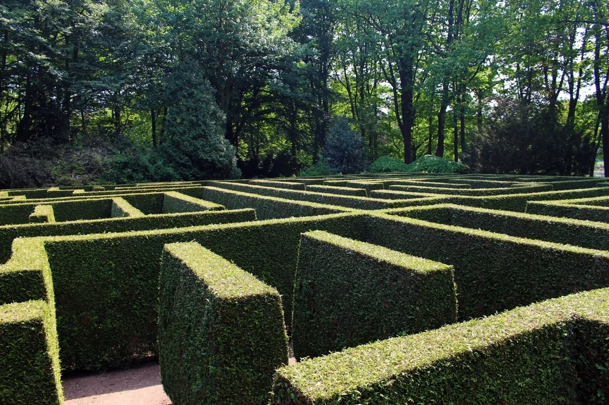
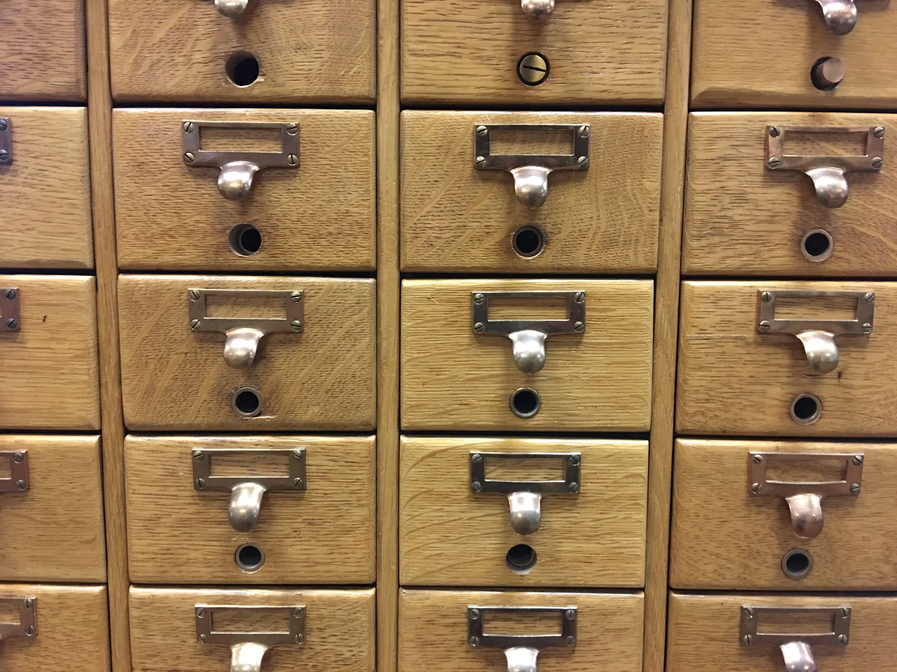
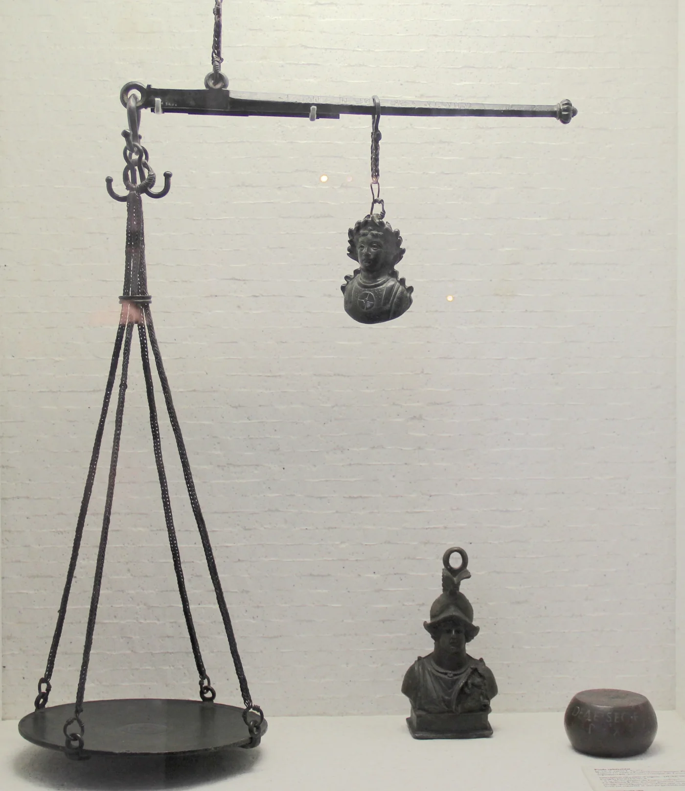
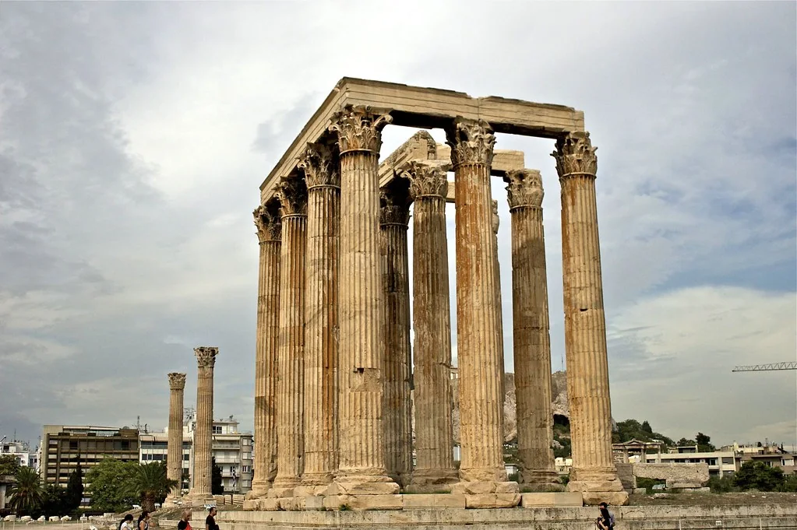
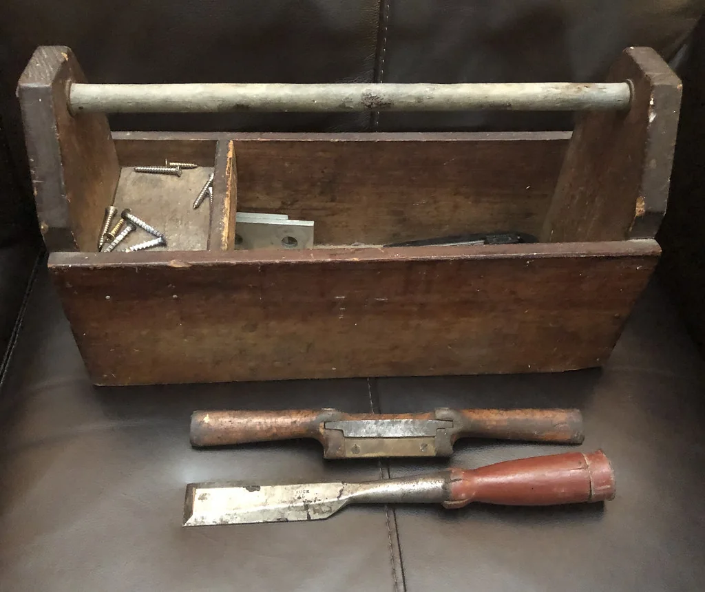

# Opening {#seg-opening}

## Quantum Oracle Engineering {#title .center}

### Lesson 1: A different computer

::: {#boil-filter}
:::

<!-- Welcome. I'm [Nishant Shukla](https://shukla.io){target="_blank" rel="noopener"}, and this is Quantum Oracle Engineering.

If you are following along live during [IEEE Quantum Week 2026](https://qce.quantum.ieee.org/2026/){target="_blank" rel="noopener"}, this is TUT-149, "Building the Oracle Step by Step for Monte Carlo Rollouts."

This first lesson builds intuition on **when a Quantum Computer might help, and more importantly, when it won't**.

We'll focus on a small practical application with a modest speedup (something that we'll likely run into in the next 10 years).

Controls: Click the arrows to navigate. Or use arrow keys. Or scroll with your mouse.
-->

## "Assume oracle access." {#assume-oracle-access .center}

::: {#oracle-collage}
:::

<!-- When you read research papers, the fun part is often left out!

**Here is a sentence you will find in many query-model speedup papers: "Assume oracle access."** 

For those unfamiliar, the "oracle" is the quantum circuit black box that we hand-wave away.

It's like a startup saying "we're raising Series D, but assume the product exists."

**Somebody still has to build it!**

And there aren't a lot of resources out there on practical oracles.

-->

## Choose, then build {#two-acts}

::: {#choose-build}
:::

<!-- Have you ever played the board game Go? It's like chess but the rules are more simple, in my opinion.

Have you heard of the two-arm bandit problem? It's like a simplified slot machine with two arms you can pull, and your job is to guess which one will maximize profit.

They're both VERY different games. In this lesson, we'll get comfortable talking about games and thinking of them as abstract concepts so we can build the AI player in a quantum computer.

**Although a quantum computer _can_ play these games, you'll see that it won't be worth it.** 

And, in the next lesson we'll introduce a game where a quantum computer _likely_ beats a classical one.
 -->

# The compute stack {#seg-compute-stack}

## CPU {#cpu}

::: {#cs-cpu}
:::

<!-- This is a CPU die, photographed in polarized light. 

**CPUs are built for minimizing latency.** They get tasks done one at a time, rapidly!

- Logic: branches, flow-charts, pipelines
- Operating System: quickly completing one thing after another
- UI: render ASAP
-->

## GPU {#gpu}

::: {#cs-gpu}
:::

<!-- **A GPU uses broad parallel execution to trade latency for throughput.**

A very simple, slightly faulty, analogy: a CPU draws one pixel at a time quickly but it takes forever to render the full scene, whereas the GPU renders the full scene all at once, without pixel-by-pixel progress.

- matrix multiplication
- graphics
- neural network training
-->

## QPU {#qpu}

::: {#cs-stack}
:::

::: {#cs-qpu}
:::

<!-- Fault-tolerant QPUs are coming soon (as you can see, I couldn't find a nice photograph for this slide).

The pattern is the same as the GPU: the processor offloads to something with a different cost model. 

Common misunderstanding: "it tries every answer and reads them all."  That's people misunderstanding superposition.

**The QPU leverage comes from preparing outcomes coherently, reusing a reversible program and its inverse, letting amplitudes interfere, and only then measuring.** 

For this course, that changes the query cost of estimating an expectation. -->

## The stack {#stack}

::: {#stack-table}
:::

<!-- Every device has its pros and cons.

**The CPU is all about minimizing latency.**

**The GPU accomplishes massive throughput.**

For our use-case, **the QPU grants precision**. Under coherent oracle access, the same number of calls to the program buys a smaller error on an expectation. 

Simulation and factoring are QPU strengths too. But, in our lessons, they are not our focus. -->

## Mismatch costs {#mismatch}

::: {#mismatch-race}
:::

<!-- Top: **the CPU executes the tasks one at a time, quickly**.

Bottom: the tasks are loaded onto the GPU. **The GPU processes with high throughput**, and then the result travels back.

This is just a simple demo to dismiss the myth that "GPUs are just faster CPUs." -->

## The precision lever {#lever}

::: {#sampling-lever}
:::

<!-- Where is a QPU useful? We have several levers. 

Two famous ones stand out of reach: simulating quantum systems and Shor-style algebra. 

**This course studies the lever for AI search: precision on an expectation.** 

-->

# The three questions {#seg-three-questions}

## Does the best classical method still sample? {#q1}

::: {#gates-1}
:::

<!-- The first gate asks whether sampling is necessary. 

**Does a classical algorithm _require_ sampling?** 

If yes, then this task randomness is a great reason to consider a QPU. 

If no, then enumeration, dynamic programming, quadrature, variance reduction or a trustworthy surrogate may still remove or shrink the need for a QPU. And guess what? **Most tasks get caught here.** -->

## Is precision the bottleneck? {#q2}

::: {#gates-2}
:::

<!-- Next, **the second gate asks whether precision is the bottleneck**. 

The first gate (randomness) on its own is not enough. 

The task has to force differences so small that telling them apart is the hard part. -->

## Is the oracle worth building? {#q3}

::: {#gates-3}
:::

<!-- Lastly, the third gate is about the cost (in terms of time) of executing the oracle on a quantum machine. 

**Every quantum query has to be cheap enough to pay for itself.** 
-->

## The assembled test {#three-questions}

::: {#gates-4}
:::

<!-- The gates help organize our thoughts, so we know when to apply quantum computing.  -->

# The mechanism {#seg-mechanism}

## Two kinds of access {#estimating}

::: {#estimate-box}
:::

<!-- Hit play to run the simulation. Each ball that shoots out of the box represents an outcome of a rollout.

There's also a quantum way of thinking about a rollout.

Let's look at the two different access models. 

**A classical sampling call returns one draw X from p.** 

**A coherent oracle A prepares the good and bad outcomes as amplitudes**, and amplitude estimation must be able to reuse A and its inverse without measuring between calls. 

If the quantum equation is scary, think of A |0> as "A is the program circuit" we run, in this case, the rollout itself.
Think: "A acts on |0> to produce an output". The output holds both |0> and |1> at once, weighted by probability, until you measure it.
  -->

## The classical rate {#classical-rate}

::: {#classical-rate-demo}
:::

<!-- Now, hit play on this demo. 

The dart shoots with some variance. The spread is constant, though we eventually get a clear answer. 

- Round 1: we shoot 100 darts
- Round 2: we shoot 400 darts (notice the circle halves)
- Round 3: we shoot 1,600 darts (and the circle only halves again)

The pattern? **You'll need four times the samples to halve its error.** 

As you x4 the number of rollouts (M), you x0.5 the error (e).

**The "gap" is how far apart two candidate moves are in win rate.** You can distinguish the candidate moves once your error is smaller than it.

-->

## The quantum rate {#quantum-rate}

::: {#quantum-rate-demo}
:::

<!-- Hit run to see a representation of how a quantum computer performs rollouts.

On the right, the quantum computer does the same job coherently. 

Watch the board, because nothing lands during the coherent calls. 

Then the estimate is measured. 

For bounded outcomes at fixed confidence, amplitude estimation achieves additive error of order one over M, so **resolving a gap g takes order one over g coherent queries rather than order one over g squared samples**. 
 -->

## The fine print {#qualifiers}

::: {#qualifiers-scale}
:::

<!-- **The quantum algorithm clearly has fewer operations, but each operation is far heavier.** 

So which algorithm do we go with? Hard to say. We'll have more to say on this soon.

Btw, **everything today assumes fault tolerance**: no variational circuits, no NISQ demonstration, no hardware claims. 
-->

# Question 1 · Sampling {#seg-question-1}

## A deterministic world {#deterministic}

::: {#tree-crisp}
:::

<!-- **Tic-tac-toe is a game with no innate randomness.** 

When X reaches for the best available move, then O reaches for the worst available for X. 

The rules and state are deterministic and known. 

On the other hand, Go is also deterministic but since it is a 19x19 board, the number of legal positions blows up. The game tree is HUGE. **It's tempting to reach out for a QPU, but that's a trap!**  -->

## The classical toolbox, part one {#toolbox-1}

<!-- **Classical solvers are very good at deterministic games.** 

Minimax is an algorithm that walks the tree, for example. Alpha-beta pruning throws away entire branches the moment it knows they cannot matter, without looking inside them. 

Are you sure a clever classical machine can't beat your quantum one?
-->

## The classical toolbox, part two {#toolbox-2}

<!-- Another classical solver trick is to use transposition tables, which memorize different move orders that reach the same position. The learned value functions score a position without much effort. 

For example, checkers was weakly solved with enormous search and endgame databases. 

Nim has a closed form. 

Connect Four is solved. 

AlphaZero learned its own priors and values without solving Go. 

**Classical structure has eliminated sampling or reduced search in one domain after another.** 
-->

## A stochastic world {#stochastic}

::: {#fanout-tree}
:::

<!-- 
By putting randomness in the environment, we make the game more challenging. 

One future turns into a distribution of futures. 

It is still a game tree, and actually a finite one could be summed exactly.

The problem is that its branching makes enumeration unaffordable. 

Under fixed policies, a practical access model is to play to the end and record the outcome. 

That is a rollout, and **one rollout is one classical sample of the expectation** shown here. -->

## Whose dice? {#whose-dice}

::: {#whose-dice}
:::

<!-- On the left, randomness belongs to the task. 

On the right, randomness belongs only to the chosen solver. 

**Solver dice are a warning that another classical algorithm may remove the sampling.** 

**Task dice make the problem a better quantum candidate.**  -->

## Escape hatches {#escape-hatches}

<!-- **Even when the randomness belongs to the task, sampling is not automatic.** 

If the state space is small enough to enumerate, dynamic programming computes the expectation outright. 

In low dimensions, quadrature solves it without any need for a QPU. 

Also, a learned approximator can skip the expectation altogether. -->

## Where the hatches fail {#hatches-fail}

<!-- Depth!

When the state space explodes, enumeration is hard! 

Quadrature dies in high dimensions. 

Approximator bias is hard to bound over a long horizon. 

**That is the regime where sampling is the last resort standing**, and that regime is the opening. -->

## The diagnostic {#diagnostic}

::: {#diagnostic}
:::

<!-- In summary, the first gate was all about "**does sampling still dominate after considering the strongest classical reformulation**."  -->

# Question 2 · Precision {#seg-question-2}

## An easy comparison {#easy-comparison}

::: {#candidates-apart}
:::

<!-- Next, let's talk about precision. 

What do we mean by precision?

Here are two candidate actions, and the distribution of outcomes for each. 

If each rollout leads to one of two outcomes here, then how many rollouts do we need? Ten, a hundred, a thousand? 

The bracket underneath is the gap. When it is this wide, **a few hundred rollouts settle the matter and no quantum computer is necessary**. -->

## A hard comparison {#hard-comparison}

::: {#candidates-close}
:::

<!-- Take a look at how close these two are. 

How many rollouts would you need now? 

Notice the narrow gap. **Each action's spread stayed fixed; only the means moved close enough to make precision expensive.** -->

## The cost, itemized {#the-bill}

::: {#the-cost}
:::

<!-- Compare the 3 gaps (g).

Gray = classical. Blue = quantum.

**If your task requires distinguishing a small gap, quantum may help.** -->

## The classical counterpunch {#counterpunch}

::: {#cores}
:::

<!-- One more thing before we move on. 

Independent rollouts parallelize beautifully. 

In an optimistic baseline with perfect scaling, a thousand cores divide the sampling time by a thousand. 

Sure, there's overhead in scheduling, communication and management, but using the optimistic classical baseline makes the quantum comparison harder to game. 

**Every classical worker raises the bar for the QPU to clear.** -->

# Question 3 · The oracle {#seg-question-3}

## The rollout query {#query}

::: {#oracle-diagram}
:::

<!-- **This is the unitary behind one coherent oracle call.** 

It prepares the stochastic choices, runs the full rollout reversibly, and encodes the payoff in an amplitude. 

Amplitude estimation reuses this operation and its inverse; different query conventions count those calls slightly differently, and the overhead in our wall-clock model absorbs that constant bookkeeping. 
 -->

## An oracle can be heavy {#data-loading}

::: {#loading-cost}
:::

<!-- Left: the data has to be loaded first. **A million records in is already a classical scan, so the square root buys nothing.**

Right: nothing is loaded. **The rule is computed, and a thousand calls to it is practically nothing.**
-->

## Three cost sources {#cost-sources}

<!-- Three things make that circuit expensive. 

1. **The dynamics have to become reversible.** 
2. **The scratch work has to be uncomputed.** 
3. And **the randomness has to live inside the circuit**, in qubits you prepared yourself. 

 -->

## Rules that compile {#rules-compile}

::: {#rules-compile}
:::

<!-- **Simple rules yield simple circuits.** That's why Go is so relevant for quantum, and chess is less so. 

In this diagram, the cell updates by reading its four orthogonal neighbors. 

Local rules like that compile to a circuit that stays regular and shallow. 
-->

## Rules that tangle {#rules-tangle}

::: {#rules-tangle}
:::

<!-- In this example, the game rules reach across the whole board (and that dashed line going backwards is a read into earlier positions, which is what history-dependent legality means). 

Look at what happened to the circuit. It did not just get a little worse, **it got wider _and_ deeper at the same time**, and this is one step of one rollout. 

**This is where oracle cost eats the speedup you came for.** -->

## The balance {#balance}

<!-- So the balance is an optimization problem. 

On one side, a QPU saves you time by requiring fewer samples. 

On the other, executing the coherent query could itself be costly. 

When a classical sample costs nanoseconds, realistic quantum overhead is unlikely to pay at practical gaps. 

But no fixed overhead defeats a quadratic query advantage at every scale: **when rollouts are expensive and the required gap is tiny enough, the balance can tip**. 
-->

# Failure modes {#seg-failure-modes}

## Many ways claims fail {#failures-1}

<!-- Five ways these arguments go wrong, and I have made some of them myself. 

1. A weak classical baseline. 
2. Query counts quoted as though they were runtimes. 
3. Oracle cost swept under the rug by three words. 
4. Solver randomness dressed up as an inherent sampling bottleneck. 
5. And parallel resources ignored on either side. 

Tang's result is the canonical warning about the first: **match the input model before celebrating the algorithm**. The three questions and the wall-clock model catch all five. -->

## The dominoes {#dominoes}

::: {#dominoes}
:::

<!-- In 2016 there was a celebrated quantum algorithm for recommendation systems. 

**In 2018 Ewin Tang, then an undergraduate, gave a classical analogue that was only polynomially slower** under comparable strong length-square sampling access. 

That removed the claimed exponential separation, and related dequantization work spread to neighboring low-rank linear-algebra claims. 

It was a domino effect of many results tipping each other over. 

In this diagram, the slab on the right takes the same shock and holds because those query separations are proved inside their stated oracle models. Though, **end-to-end advantage still has to pay for implementing the model**. -->

# The wall-clock test {#seg-wall-clock}

## Winning queries, losing the clock {#queries-vs-clock}

::: {#scoreboard}
:::

<!-- On the left, a mountain of cheap samples through a wide throat. 

On the right, **fewer, heavier queries through one coherent query lane**. 

Parallel amplitude estimation can trade coherent depth for entangled width, connectivity, and memory.

Oshio, Wada, and Yamamoto made that trade explicit in 2026. 
-->

## The race {#race}

::: {#race}
:::

<!-- Predicting speed of computation is a valuable skill. 

Classically, one rollout costs t roll and an optimistic perfectly parallel baseline lets P cores divide the sampling time; resolving the gap costs one over g squared samples. 

On the one-lane quantum side, one coherent query costs t oracle, amplitude estimation adds the overhead C, and resolving the same gap costs one over g queries. 

The picture underneath is why these baseline expressions have different shapes: **classical work goes wide across ordinary cores; this coherent query chain goes long**. A parallel quantum architecture replaces the second line with a width-depth tradeoff and must count its entangled qubits and communication too. 

Neither lane finishes because the resource choices decide the winner. -->

## Break-even {#break-even}

::: {#break-even}
:::

<!-- **The QPU wins when the time for one oracle call is less than the time for one rollout, divided by the overhead, by the number of classical cores, and by the gap.** 

Smaller gaps grow the right-hand side, so the QPU can afford slower queries. 

More classical cores shrink it, so the bar rises. 

Btw, if you choose a parallel amplitude-estimation architecture, there's a little tweak you may need to make: add its coherent width, communication, and depth tradeoff. 

For those curious, **these equations remain true regardless of the outcome of BQP versus BPP**. 
 -->

## The toolkit, and three contenders {#toolkit}

<!-- **You have a solid toolkit: the three questions and one inequality.** 

Not too exotic, eh?
 -->

# The rest of the course {#seg-series}

## A different computer {#series-bridge}

::: {#series-bridge}
:::

<!-- Today's lesson ends here. 

**Next, lesson 2 identifies a problem worth solving.** 

Lessons 3 through 7 build the oracle, make it reversible, clean its garbage, measure safely, and borrow memory without breaking promises. 

Lesson 8 makes separately written blocks trustworthy together. 

Lessons 9 through 11 locate where the quantum advantage lives, account for its coherent memory, and turn that cost into a test. 

Lesson 12 brings the three questions and the wall-clock math back to the next AI miracle. 

 -->

## The address {#qr .bare}

::: {#qr}
:::

<!-- Click the link to open Lesson 2. -->
