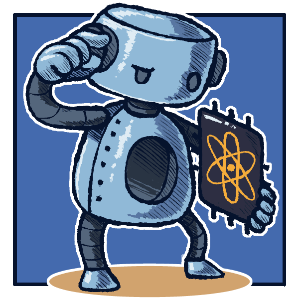
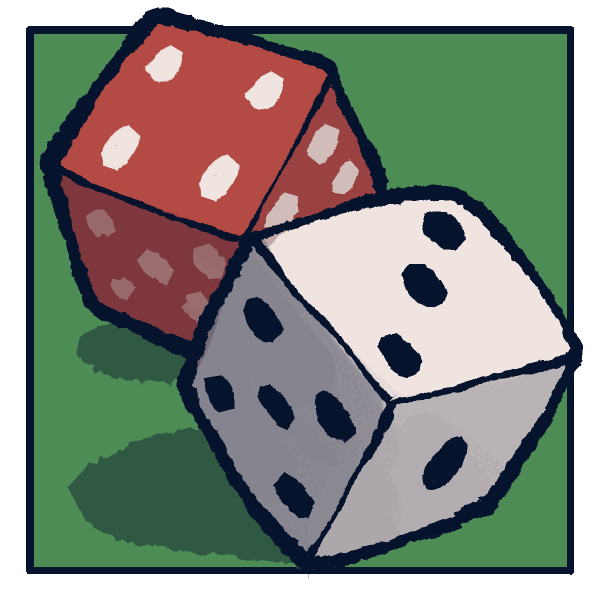
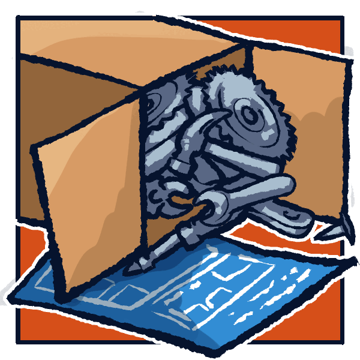
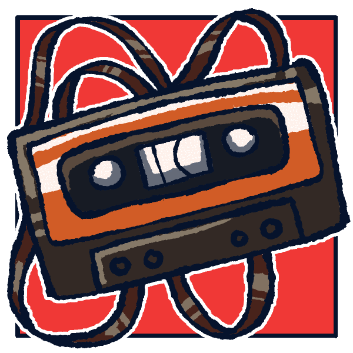
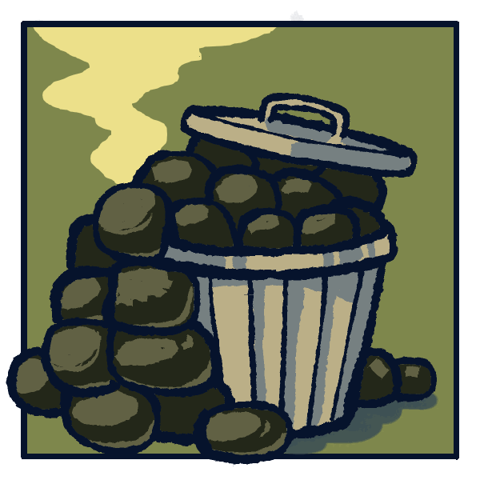
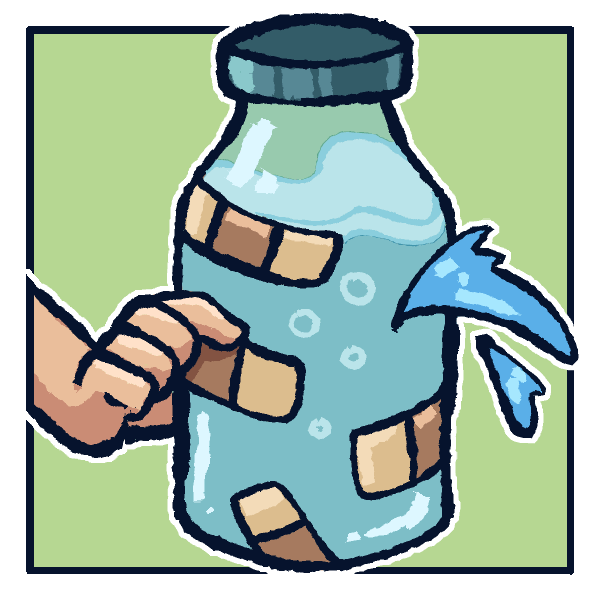
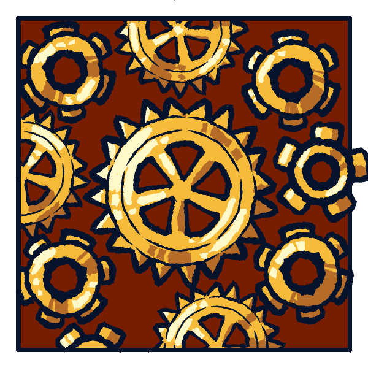
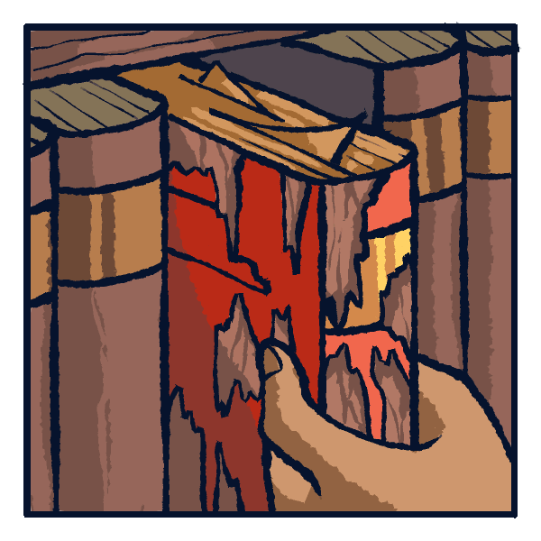
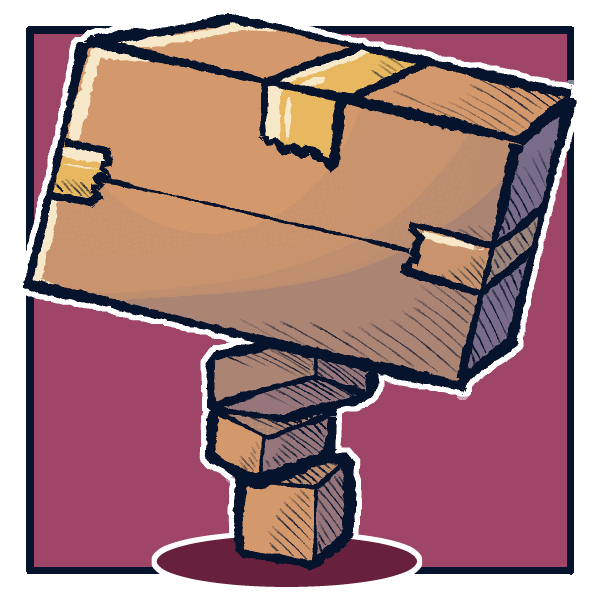
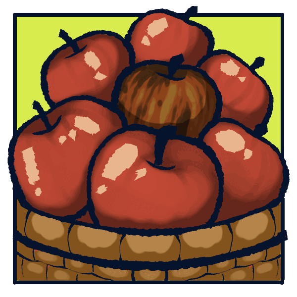

# Quantum Oracle Engineering

## A Programmer's Guide to Building the Right Oracle

::: {.venue}
[IEEE Quantum Week 2026 (QCE26)](https://qce.quantum.ieee.org/2026/), Toronto, Canada.
:::

::: {.intro}
Most quantum speedup claims depend on an oracle that exists only on paper.
This course teaches the craft of building practical quantum circuits from scratch.
:::

::: {.subscribe}
<form class="subscribe-form">
<input type="email" required autocomplete="email" placeholder="you@example.com" aria-label="Email address">
<button type="submit">Notify me</button>
</form>
:::

:::: {.lessons}

Choose the problem, build the oracle

::: {.lesson data-lesson="qoe-lesson-01" style="--accent: #456AAD"}
### 1. A different computer

<figure class="art"></figure>

- most AI problems don't qualify
- CPU, GPU, **QPU**: different jobs
- for AI search, test one lever: **coherent precision**
- **three questions** to ask first
- famous overpromises, dissected
- knowing when to walk away

<button class="coming" disabled>Coming Sept 1</button>
:::

::: {.lesson data-lesson="qoe-lesson-02" style="--accent: #4D8C55"}
### 2. The Monte Carlo speedup

<figure class="art"></figure>

- the folklore, with **fine print**
- the trick: **precision on averages**
- how the **square root** actually happens
- a query-counting **proof**: classical can't keep up
- **Go** flunks, a **sampled bandit** flunks
- so we invented a game of **close calls**

<button class="coming" disabled>Coming Sept 8</button>
:::

::: {.lesson data-lesson="qoe-lesson-03" style="--accent: #C35523"}
### 3. Ship it

<figure class="art"></figure>

- "**assume the oracle exists**," says every paper
- we stop assuming and build it, **gate by gate**
- a game board made of qubits
- all the randomness, **loaded up front**
- picking moves without **skewing the odds**
- the **scratch work** starts piling up

<button class="coming" disabled>Coming Sept 15</button>
:::

::: {.lesson data-lesson="qoe-lesson-04" style="--accent: #F03836"}
### 4. Reversible by design

<figure class="art"></figure>

- the finished circuit must **run backward**
- every cell updates **at once**, or bugs
- the **self-flip trap**
- **snapshot** the board, then swap
- one qubit holds the score
- the full bill, in qubits

<button class="coming" disabled>Coming Sept 22</button>
:::

Make it correct

::: {.lesson data-lesson="qoe-lesson-05" style="--accent: #7E874C"}
### 5. Garbage collection

<figure class="art"></figure>

- there is **no delete**
- leftover junk stays **tied to your answer**
- and quietly poisons it
- forgetting means **undoing history**
- compute, use, **uncompute**
- clean scratch still doesn't mean right answer

<button class="coming" disabled>Coming Sept 29</button>
:::

::: {.lesson data-lesson="qoe-lesson-06" style="--accent: #B6D792"}
### 6. Measure to erase

<figure class="art"></figure>

- the rule every course teaches: **never peek**
- production circuits **peek anyway**
- **measure the garbage** on purpose
- patch the damage with **phase fixes**
- **cheapest eraser** there is
- machine-checked rules for when it's safe

<button class="coming" disabled>Coming Oct 6</button>
:::

::: {.lesson data-lesson="qoe-lesson-07" style="--accent: #761D01"}
### 7. Calling conventions

<figure class="art"></figure>

- scratch you can use but **never inspect**
- **clean, borrowed, conditionally clean**
- returning it as you found it **isn't enough**
- promises checked **where blocks meet**
- Rust's **borrow checker**, but for qubits
- mismatched promises, **no deal**

<button class="coming" disabled>Coming Oct 13</button>
:::

::: {.lesson data-lesson="qoe-lesson-08" style="--accent: #D9EB4E"}
### 8. Proof-carrying circuits

<figure class="art"></figure>

- circuits that **ace every test**, wrongly
- **hidden phases**, invisible to truth tables
- checking everything costs **2^n**
- escape hatch: **one proof per circuit family**
- every block ships with a **seal**, checked in milliseconds
- strangers' code, **safely composed**

<button class="coming" disabled>Coming Oct 20</button>
:::

Price it, test it, judge it

::: {.lesson data-lesson="qoe-lesson-09" style="--accent: #966B55"}
### 9. Where the quantum lives

<figure class="art"></figure>

- every page is a **classical** drawing
- the animation is **impossible**
- each step has a **classical model**; they refuse to glue
- one story per step, **no story overall**
- where the quantum actually **lives**
- and the gap has a price, in **coherent memory**

<button class="coming" disabled>Coming Oct 27</button>
:::

::: {.lesson data-lesson="qoe-lesson-10" style="--accent: #9598CA"}
### 10. All or nothing

<figure class="art"></figure>

- buying in bulk should get cheaper
- it doesn't: **qubits of memory**, zero or linear, nothing between
- no **amortizing**, no compressing, no caching
- copy 1,000,000 costs what copy 1 cost
- a **theorem**, not a hunch
- why the flipbook can't be **fixed**

<button class="coming" disabled>Coming Nov 3</button>
:::

::: {.lesson data-lesson="qoe-lesson-11" style="--accent: #92BBA8"}
### 11. Test, don't trust

<figure class="art"></figure>

- a **tabletop test** for quantum claims
- no lab, no tomography
- fakers pay the **qubit memory bill** or fold
- any implementation, **no peeking inside**
- benchmarks that can't be **gamed**
- pretenders fail **exponentially fast**

<button class="coming" disabled>Coming Nov 10</button>
:::

::: {.lesson data-lesson="qoe-lesson-12" style="--accent: #9F4668"}
### 12. Audit the next claim

<figure class="art"></figure>

- the **reigning faith** of the AI era
- what the evidence says
- where quantum could fit in AI
- **lesson 1's questions**, aimed at the headlines
- **wall-clock math**, not gut feel
- how to judge the **next miracle**

<button class="coming" disabled>Coming Nov 17</button>
:::

::::

::: {.agenda}
### Live Tutorial Agenda

Session 1 (90 minutes): Lessons 1 and 2, identifying a problem worth accelerating.

Session 2 (90 minutes): Lessons 3 and 4, building the rollout oracle.

For practitioners and researchers comfortable with qubits, controlled gates,
and circuit diagrams.
:::

::: {.pagefoot}
Taught by [Nishant Shukla](https://shukla.io) · Art by [Lazybuns](https://lazybunsart.carrd.co)
:::

<!-- The boil: noise displacing the artwork a couple of pixels, reseeded four
     times a second, so a pointed-at illustration wobbles the way hand-drawn
     animation does.  It has to live in the body; an <svg> in <head> ends the
     head element as far as the parser is concerned. -->
<svg class="filters" aria-hidden="true" focusable="false">
  <!-- Mid grey means "displace by nothing", so the map is grey everywhere and
       noisy only well inside the drawn frame, which every illustration puts
       26px (4.3%) from its edge.  The blurred rectangle fades the noise back
       to grey before it reaches the ink, so the frame and the margin outside
       it hold still while the picture inside them moves.  sRGB interpolation
       is required, not decoration: in the default linearRGB, #808080 is not
       the neutral value and the whole image drifts to one side.
       primitiveUnits are object-bound so every length below is a fraction of
       the card and the effect holds its proportions at any width.  Do not
       write these as percentages: a percentage subregion is ignored here, the
       flood silently covers the whole region, and the mask stops working with
       no error anywhere.  The displacement scale is a fraction too, so 0.007
       is the ~2px it reads as on a 290px card. -->
  <filter id="boil" x="0" y="0" width="100%" height="100%"
          color-interpolation-filters="sRGB" primitiveUnits="objectBoundingBox">
    <feTurbulence type="fractalNoise" baseFrequency="0.018" numOctaves="2" seed="4" result="raw">
      <animate attributeName="seed" values="1;2;3;4" dur="0.5s" calcMode="discrete" repeatCount="indefinite"/>
    </feTurbulence>
    <!-- feTurbulence writes noise into the alpha channel too; force it opaque
         so the rectangle below is the only thing masking it. -->
    <feColorMatrix in="raw" type="matrix" result="noise"
                   values="1 0 0 0 0
                           0 1 0 0 0
                           0 0 1 0 0
                           0 0 0 0 1"/>
    <feFlood flood-color="#808080" result="still"/>
    <feFlood flood-color="#ffffff" x="0.08" y="0.08" width="0.84" height="0.84" result="inside"/>
    <feGaussianBlur in="inside" stdDeviation="0.025" result="edge"/>
    <feComposite in="noise" in2="edge" operator="in" result="inner"/>
    <feComposite in="inner" in2="still" operator="over" result="map"/>
    <feDisplacementMap in="SourceGraphic" in2="map" scale="0.007" xChannelSelector="R" yChannelSelector="G"/>
  </filter>
  <!-- The same boil, retuned for the narrow layout, where the artwork renders
       at 16em instead of a 290px card.  Two numbers differ and they have to,
       because both resist being made proportional:
       `scale` is a fraction of the element, so it already shrinks with the
       art, but the smaller render also squeezes a 600px source harder, which
       smooths the ink and leaves less edge for a displacement to move.  The
       result measured 0.28x as much frame-to-frame motion as the desktop card.
       `baseFrequency` ignores primitiveUnits and stays in user space, so a
       smaller element gets fewer, larger noise cells across it, turning a boil
       into a slow warp.  Raising it restores the cell count.
       0.008 and 0.020 were picked by sweeping both against the desktop card
       and measuring motion between two seeds; this pair lands at 0.95x.  A
       filter cannot inherit another's primitives, so the chain is repeated. -->
  <filter id="boil-narrow" x="0" y="0" width="100%" height="100%"
          color-interpolation-filters="sRGB" primitiveUnits="objectBoundingBox">
    <feTurbulence type="fractalNoise" baseFrequency="0.020" numOctaves="2" seed="4" result="raw">
      <animate attributeName="seed" values="1;2;3;4" dur="0.5s" calcMode="discrete" repeatCount="indefinite"/>
    </feTurbulence>
    <feColorMatrix in="raw" type="matrix" result="noise"
                   values="1 0 0 0 0
                           0 1 0 0 0
                           0 0 1 0 0
                           0 0 0 0 1"/>
    <feFlood flood-color="#808080" result="still"/>
    <feFlood flood-color="#ffffff" x="0.08" y="0.08" width="0.84" height="0.84" result="inside"/>
    <feGaussianBlur in="inside" stdDeviation="0.025" result="edge"/>
    <feComposite in="noise" in2="edge" operator="in" result="inner"/>
    <feComposite in="inner" in2="still" operator="over" result="map"/>
    <feDisplacementMap in="SourceGraphic" in2="map" scale="0.008" xChannelSelector="R" yChannelSelector="G"/>
  </filter>
</svg>
